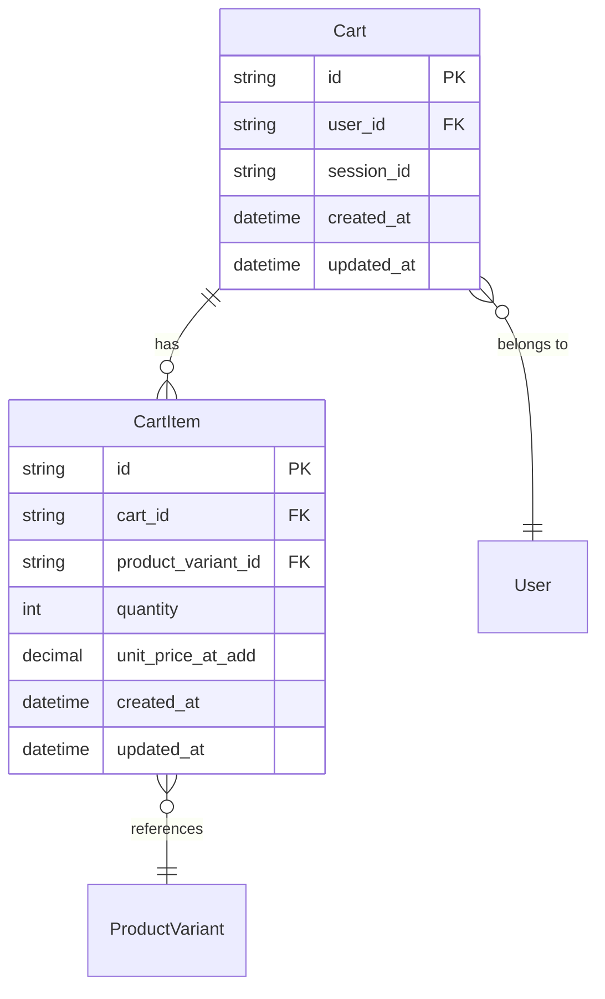
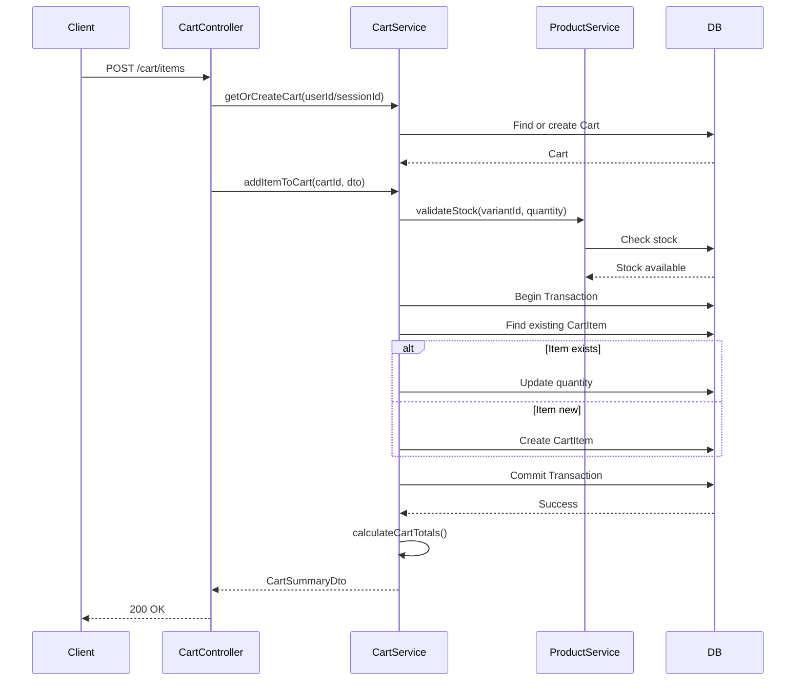
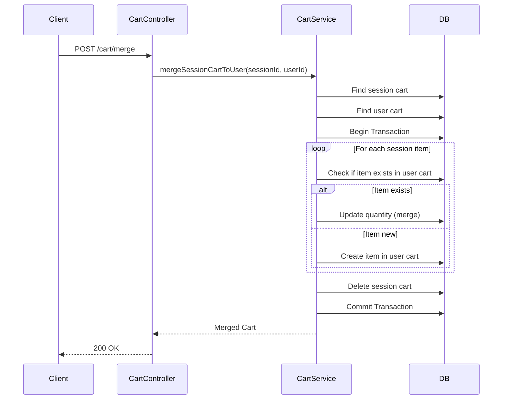

# Technical Design Document: Shopping Cart Module (FE.03)

## 1. Overview

Module Shopping Cart cung cấp đầy đủ chức năng quản lý giỏ hàng cho khách hàng trong hệ thống e-commerce. Module hỗ trợ cả khách hàng đã đăng nhập và khách vãng lai, cho phép thêm sản phẩm, cập nhật số lượng, xóa sản phẩm và tự động tính toán tổng tiền. Module cũng xử lý việc merge giỏ hàng session với giỏ hàng user khi khách hàng đăng nhập.

**SRS Reference**: FE.03 - Quản lý Giỏ hàng

## 2. Requirements

### 2.1 Functional Requirements

- **FE.03.1**: Khách hàng có thể thêm sản phẩm (và biến thể cụ thể) vào giỏ hàng từ trang danh sách hoặc trang chi tiết sản phẩm
- **FE.03.2**: Xem chi tiết giỏ hàng: danh sách sản phẩm, hình ảnh, tên, biến thể, đơn giá, số lượng, thành tiền từng sản phẩm
- **FE.03.3**: Cập nhật số lượng sản phẩm trong giỏ
- **FE.03.4**: Xóa sản phẩm khỏi giỏ hàng
- **FE.03.5**: Giỏ hàng tự động tính toán tổng tiền tạm tính
- **FE.03.6**: Giỏ hàng được lưu trữ cho khách hàng đã đăng nhập khi họ điều hướng sang trang khác hoặc thoát và quay lại

**User Stories:**
- As a customer, I want to add products to my cart so that I can purchase multiple items at once
- As a customer, I want to update item quantities in my cart so that I can adjust my order
- As a customer, I want my cart to persist after login so that I don't lose my selected items
- As a guest user, I want to add items to a session cart so that I can shop without creating an account

### 2.2 Non-Functional Requirements

- **Performance**: 
  - Cart retrieval response time < 200ms
  - Add to cart operation < 300ms
  - Support concurrent cart operations for multiple users
- **Security**: 
  - Cart ownership validation (users can only access their own carts)
  - Rate limiting on cart operations (100 requests/minute, 20 requests/minute for add to cart)
  - Input validation for all cart operations
- **Scalability**: 
  - Support up to 10,000 active carts simultaneously
  - Efficient caching strategy for cart data
- **Consistency**: 
  - Handle race conditions when multiple users add same product variant
  - Price snapshot at time of adding to cart
  - Stock validation before adding items

## 3. Technical Design

### 3.1. Database Schema Changes (Sequelize)

#### 3.1.1 Cart Entity

```typescript
import { Table, Column, Model, DataType, PrimaryKey, ForeignKey, BelongsTo, HasMany, Index, AllowNull } from 'sequelize-typescript';
import { User } from 'src/user/user.entity';
import { CartItem } from './cart-item.entity';

@Table({ tableName: 'tbl_cart', timestamps: false })
export class Cart extends Model<Cart> {
  @PrimaryKey
  @Column({ type: DataType.STRING(36) })
  id!: string;

  @AllowNull(true)
  @ForeignKey(() => User)
  @Index('idx_user_id')
  @Column({ type: DataType.STRING(36) })
  user_id?: string;

  @AllowNull(true)
  @Index('idx_session_id')
  @Column({ type: DataType.STRING(255) })
  session_id?: string;

  @Column({ type: DataType.DATE, defaultValue: DataType.NOW })
  created_at!: Date;

  @Column({ type: DataType.DATE, defaultValue: DataType.NOW })
  updated_at!: Date;

  @BelongsTo(() => User)
  user?: User;

  @HasMany(() => CartItem)
  items?: CartItem[];
}
```

#### 3.1.2 Cart Item Entity

```typescript
import { Table, Column, Model, DataType, PrimaryKey, ForeignKey, BelongsTo, Index, AllowNull, Unique } from 'sequelize-typescript';
import { Cart } from './cart.entity';
import { ProductVariant } from 'src/product/product-variant.entity';

@Table({ tableName: 'tbl_cart_item', timestamps: false })
export class CartItem extends Model<CartItem> {
  @PrimaryKey
  @Column({ type: DataType.STRING(36) })
  id!: string;

  @ForeignKey(() => Cart)
  @Index('idx_cart_id')
  @Column({ type: DataType.STRING(36), allowNull: false })
  cart_id!: string;

  @ForeignKey(() => ProductVariant)
  @Index('idx_product_variant_id')
  @Column({ type: DataType.STRING(36), allowNull: false })
  product_variant_id!: string;

  @Column({ type: DataType.INTEGER, allowNull: false, defaultValue: 1 })
  quantity!: number;

  @Column({ type: DataType.DECIMAL(10, 2), allowNull: false })
  unit_price_at_add!: number;

  @Column({ type: DataType.DATE, defaultValue: DataType.NOW })
  created_at!: Date;

  @Column({ type: DataType.DATE, defaultValue: DataType.NOW })
  updated_at!: Date;

  @BelongsTo(() => Cart)
  cart?: Cart;

  @BelongsTo(() => ProductVariant)
  productVariant?: ProductVariant;

  @Unique('unique_cart_variant')
  @Index('idx_cart_variant')
  static uniqueCartVariant: any;
}
```

#### 3.1.3 ERD Diagram



### 3.2. Backend Implementation (NestJS)

#### 3.2.1 Module Structure

```
src/cart/
├── cart.entity.ts
├── cart-item.entity.ts
├── cart.controller.ts
├── cart.service.ts
├── cart-calculation.service.ts
├── cart.module.ts
├── cart.providers.ts
├── dto/
│   ├── add-to-cart.dto.ts
│   ├── update-cart-item.dto.ts
│   ├── cart-summary.dto.ts
│   └── cart-query.dto.ts
├── interfaces/
│   ├── cart.interface.ts
│   └── cart-calculation.interface.ts
└── guards/
    └── cart-ownership.guard.ts
```

#### 3.2.2 API Endpoints

```typescript
@Controller('cart')
@ApiTags('cart')
@UseGuards(ThrottlerGuard)
@Throttle(100, 60) // 100 requests per minute
export class CartController {
  
  @Get()
  @ApiOperation({ summary: 'Get current cart' })
  @UseGuards(OptionalJwtAuthGuard)
  async getCart(@Req() request: Request): Promise<CartSummaryDto>

  @Post('items')
  @ApiOperation({ summary: 'Add item to cart' })
  @UseGuards(OptionalJwtAuthGuard)
  @Throttle(20, 60) // Stricter limit for add to cart
  async addItem(@Body() addToCartDto: AddToCartDto, @Req() request: Request): Promise<CartSummaryDto>

  @Put('items/:itemId')
  @ApiOperation({ summary: 'Update cart item quantity' })
  @UseGuards(OptionalJwtAuthGuard, CartOwnershipGuard)
  async updateItem(@Param('itemId') itemId: string, @Body() updateDto: UpdateCartItemDto): Promise<CartSummaryDto>

  @Delete('items/:itemId')
  @ApiOperation({ summary: 'Remove item from cart' })
  @UseGuards(OptionalJwtAuthGuard, CartOwnershipGuard)
  async removeItem(@Param('itemId') itemId: string, @Req() request: Request): Promise<CartSummaryDto>

  @Delete()
  @ApiOperation({ summary: 'Clear entire cart' })
  @UseGuards(OptionalJwtAuthGuard)
  async clearCart(@Req() request: Request): Promise<void>

  @Post('merge')
  @ApiOperation({ summary: 'Merge session cart with user cart after login' })
  @UseGuards(JwtAuthGuard)
  async mergeCart(@Body() sessionCartData: any, @Req() request: Request): Promise<CartSummaryDto>

  @Get('count')
  @ApiOperation({ summary: 'Get cart items count' })
  @UseGuards(OptionalJwtAuthGuard)
  async getCartCount(@Req() request: Request): Promise<{ count: number }>
}
```

#### 3.2.3 Service Logic

```typescript
@Injectable()
export class CartService extends CrudService<Cart> {
  constructor() {
    super(Cart);
  }

  // Cart retrieval
  async getCartByUser(userId: string): Promise<Cart> {
    return Cart.findOne({
      where: { user_id: userId },
      include: [{ model: CartItem, include: [ProductVariant] }]
    });
  }

  async getCartBySession(sessionId: string): Promise<Cart> {
    return Cart.findOne({
      where: { session_id: sessionId },
      include: [{ model: CartItem, include: [ProductVariant] }]
    });
  }

  async getOrCreateCart(userId?: string, sessionId?: string): Promise<Cart> {
    const t = await this.transaction();
    try {
      let cart: Cart;
      
      if (userId) {
        cart = await this.getCartByUser(userId);
      } else if (sessionId) {
        cart = await this.getCartBySession(sessionId);
      }

      if (!cart) {
        cart = await Cart.create({
          id: uuidv4(),
          user_id: userId || null,
          session_id: sessionId || null
        }, { transaction: t });
      }

      await t.commit();
      return cart;
    } catch (error) {
      await t.rollback();
      throw error;
    }
  }

  // Item management with transaction
  async addItemToCart(cartId: string, addToCartDto: AddToCartDto): Promise<Cart> {
    const t = await this.transaction();
    try {
      // Validate stock
      const variant = await ProductVariant.findByPk(addToCartDto.productVariantId);
      if (!variant || variant.stock_quantity < addToCartDto.quantity) {
        throw new InsufficientStockException(
          variant?.name || 'Product',
          variant?.stock_quantity || 0,
          addToCartDto.quantity
        );
      }

      // Check if item already exists in cart
      const existingItem = await CartItem.findOne({
        where: {
          cart_id: cartId,
          product_variant_id: addToCartDto.productVariantId
        }
      });

      if (existingItem) {
        // Update quantity
        const newQuantity = existingItem.quantity + addToCartDto.quantity;
        await existingItem.update({ quantity: newQuantity }, { transaction: t });
      } else {
        // Create new item
        await CartItem.create({
          id: uuidv4(),
          cart_id: cartId,
          product_variant_id: addToCartDto.productVariantId,
          quantity: addToCartDto.quantity,
          unit_price_at_add: variant.base_price
        }, { transaction: t });
      }

      await t.commit();
      return this.getCartById(cartId);
    } catch (error) {
      await t.rollback();
      throw error;
    }
  }

  // Cart calculations
  async calculateCartTotals(cartId: string): Promise<CartCalculation> {
    const cart = await Cart.findByPk(cartId, {
      include: [{ model: CartItem, include: [ProductVariant] }]
    });

    if (!cart || !cart.items) {
      throw new CartNotFoundException(cartId);
    }

    const subtotal = cart.items.reduce((sum, item) => {
      return sum + (item.unit_price_at_add * item.quantity);
    }, 0);

    // Apply promotions (if any)
    const discountAmount = 0; // TODO: Implement promotion logic
    const taxAmount = 0; // TODO: Implement tax calculation
    const shippingAmount = 0; // TODO: Implement shipping calculation

    const total = subtotal - discountAmount + taxAmount + shippingAmount;

    return {
      subtotal,
      taxAmount,
      discountAmount,
      shippingAmount,
      total,
      appliedPromotions: []
    };
  }
}
```

#### 3.2.4 Data Access Patterns

- Use Sequelize transactions for all cart modifications
- Use `include` for eager loading cart items and product variants
- Use `attributes` to select only needed fields
- Implement proper indexing on `user_id`, `session_id`, `cart_id`, `product_variant_id`

### 3.3. Logic Flow

#### 3.3.1 Add Item to Cart Flow



#### 3.3.2 Merge Cart Flow (After Login)



### 3.4. Security & Performance

#### 3.4.1 Authentication/Authorization

- **OptionalJwtAuthGuard**: Allow both authenticated and guest users
- **CartOwnershipGuard**: Ensure users can only access their own carts
- **Rate Limiting**: 100 requests/minute general, 20 requests/minute for add to cart

#### 3.4.2 Validation

- DTO validation using `class-validator` decorators
- Stock validation before adding items
- Quantity limits (max 999 per item, max 100 items per cart)

#### 3.4.3 Caching Strategy

- Redis caching for frequently accessed carts (TTL: 1 hour)
- Cache cart item counts (TTL: 5 minutes)
- Invalidate cache on cart modifications

#### 3.4.4 Database Locking

- Use Sequelize transactions for atomic operations
- Optimistic locking for concurrent cart updates
- Stock reservation mechanism (15 minutes TTL)

## 4. Testing Plan

### 4.1 Unit Tests

- Cart service business logic
- Cart calculation accuracy
- DTO validation
- Business rules enforcement
- Stock validation logic

### 4.2 Integration Tests

- API endpoints functionality
- Database operations with transactions
- Cache operations
- Event handling
- Cart merge scenarios

### 4.3 E2E Tests

- Complete cart flow (add → update → remove → clear)
- Cart merge after login
- Price and stock validation
- Session cart persistence
- Concurrent cart operations

## 5. Alternatives Considered

### 5.1 Cart Storage Strategy

**Option A: Database-only storage**
- Pros: Simple, persistent, easy to query
- Cons: Higher database load, slower for frequent reads
- **Chosen**: Database with Redis caching for performance

**Option B: Redis-only storage**
- Pros: Very fast, good for session carts
- Cons: Data loss risk, complex persistence logic
- **Rejected**: Risk of data loss, harder to query

### 5.2 Price Snapshot Strategy

**Option A: Snapshot at add time (current)**
- Pros: Price consistency, customer sees what they added
- Cons: Price changes not reflected until update
- **Chosen**: Better user experience, prevents price disputes

**Option B: Always use current price**
- Pros: Always up-to-date prices
- Cons: Price can change during checkout, confusing UX
- **Rejected**: Poor user experience, potential disputes

### 5.3 Cart Merge Strategy

**Option A: Merge quantities (current)**
- Pros: Preserves all items, combines quantities
- Cons: May exceed stock limits
- **Chosen**: Better UX, handles edge cases in service

**Option B: Replace session cart**
- Pros: Simpler logic
- Cons: Loses user cart items
- **Rejected**: Poor UX, loses user's existing cart

## 6. Implementation Checklist

- [ ] Create Cart and CartItem entities with Sequelize decorators
- [ ] Create migration files for cart tables
- [ ] Implement CartService with CRUD operations
- [ ] Implement CartCalculationService
- [ ] Create DTOs with validation
- [ ] Implement CartController with all endpoints
- [ ] Implement CartOwnershipGuard
- [ ] Add rate limiting
- [ ] Implement Redis caching
- [ ] Add transaction handling for cart operations
- [ ] Implement stock validation
- [ ] Add cart merge logic
- [ ] Write unit tests
- [ ] Write integration tests
- [ ] Write E2E tests
