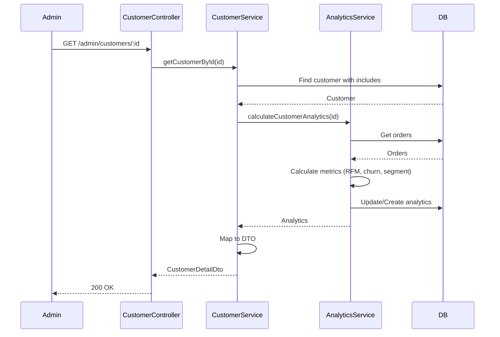
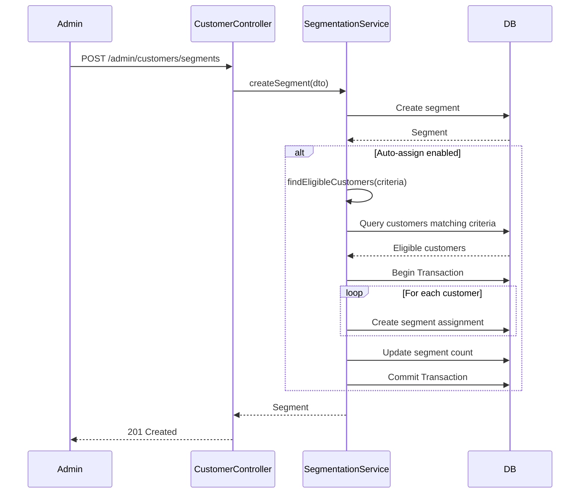

# Technical Design Document: Customer Management Module (BE.03)

## 1. Overview

Module Customer Management cung cấp đầy đủ công cụ quản lý khách hàng cho Admin và Nhân viên, bao gồm xem thông tin chi tiết, phân tích hành vi mua hàng, quản lý trạng thái tài khoản, và phân khúc khách hàng. Module này hỗ trợ việc hiểu rõ khách hàng để đưa ra các quyết định kinh doanh tốt hơn.

**SRS Reference**: BE.03 - Quản lý Khách hàng

## 2. Requirements

### 2.1 Functional Requirements

- **BE.03.1**: Xem danh sách khách hàng với bộ lọc nâng cao (theo trạng thái, segment, tổng chi tiêu, số đơn hàng)
- **BE.03.2**: Xem thông tin chi tiết khách hàng (thông tin cá nhân, lịch sử mua hàng, địa chỉ)
- **BE.03.3**: Kích hoạt/Vô hiệu hóa tài khoản khách hàng (Admin only)
- **BE.03.4**: Phân tích hành vi và lịch sử mua hàng (RFM analysis, churn risk, lifetime value)
- **BE.03.5**: Quản lý ghi chú nội bộ cho khách hàng
- **BE.03.6**: Phân khúc khách hàng (segmentation) với criteria động
- **BE.03.7**: Xuất báo cáo khách hàng (Excel/CSV)

**User Stories:**
- As an admin, I want to view customer details so that I can understand their purchase history
- As an admin, I want to see customer analytics so that I can identify high-value customers
- As an admin, I want to segment customers so that I can target marketing campaigns
- As an admin, I want to add notes to customers so that I can track interactions
- As an admin, I want to export customer data so that I can analyze in external tools

### 2.2 Non-Functional Requirements

- **Performance**: 
  - Customer listing with filters < 500ms
  - Customer analytics calculation < 2 seconds
  - Support pagination for large customer lists
  - Efficient caching for frequently accessed customer data
- **Security**: 
  - Role-based access control (Admin/Staff only)
  - Customer data protection (GDPR compliance)
  - Sensitive data masking in exports
  - Audit logging for customer data access
- **Scalability**: 
  - Handle 100K+ customers efficiently
  - Background processing for analytics calculations
  - Incremental analytics updates
- **Consistency**: 
  - Analytics data consistency with orders
  - Real-time updates for critical metrics
  - Scheduled batch updates for heavy calculations

## 3. Technical Design

### 3.1. Database Schema Changes (Sequelize)

#### 3.1.1 Customer Note Entity

```typescript
import { Table, Column, Model, DataType, PrimaryKey, ForeignKey, BelongsTo, Index, AllowNull, Default } from 'sequelize-typescript';
import { User } from 'src/user/user.entity';

@Table({ tableName: 'tbl_customer_note', timestamps: false })
export class CustomerNote extends Model<CustomerNote> {
  @PrimaryKey
  @Column({ type: DataType.STRING(36) })
  id!: string;

  @ForeignKey(() => User)
  @Index('idx_customer_id')
  @Column({ type: DataType.STRING(36), allowNull: false })
  customer_id!: string;

  @ForeignKey(() => User)
  @Index('idx_author_id')
  @Column({ type: DataType.STRING(36), allowNull: false })
  author_id!: string;

  @AllowNull(true)
  @Column({ type: DataType.STRING(255) })
  title?: string;

  @Column({ type: DataType.TEXT, allowNull: false })
  content!: string;

  @Default('general')
  @Index('idx_type')
  @Column({ type: DataType.ENUM('general', 'support', 'sales', 'complaint', 'feedback') })
  type!: string;

  @Default('medium')
  @Index('idx_priority')
  @Column({ type: DataType.ENUM('low', 'medium', 'high', 'critical') })
  priority!: string;

  @Default(true)
  @Column({ type: DataType.BOOLEAN })
  is_internal!: boolean;

  @Column({ type: DataType.JSON })
  tags?: string[];

  @Column({ type: DataType.DATE, defaultValue: DataType.NOW })
  created_at!: Date;

  @Column({ type: DataType.DATE, defaultValue: DataType.NOW })
  updated_at!: Date;

  @BelongsTo(() => User, { foreignKey: 'customer_id', as: 'customer' })
  customer?: User;

  @BelongsTo(() => User, { foreignKey: 'author_id', as: 'author' })
  author?: User;
}
```

#### 3.1.2 Customer Analytics Entity

```typescript
@Table({ tableName: 'tbl_customer_analytics', timestamps: false })
export class CustomerAnalytics extends Model<CustomerAnalytics> {
  @PrimaryKey
  @Column({ type: DataType.STRING(36) })
  id!: string;

  @ForeignKey(() => User)
  @Unique
  @Column({ type: DataType.STRING(36), allowNull: false })
  customer_id!: string;

  // Order Statistics
  @Default(0)
  @Column({ type: DataType.INTEGER })
  total_orders!: number;

  @Default(0)
  @Column({ type: DataType.DECIMAL(15, 2) })
  total_spent!: number;

  @Default(0)
  @Column({ type: DataType.DECIMAL(10, 2) })
  average_order_value!: number;

  @AllowNull(true)
  @Index('idx_last_order_date')
  @Column({ type: DataType.DATE })
  last_order_date?: Date;

  @AllowNull(true)
  @Column({ type: DataType.INTEGER })
  days_since_last_order?: number;

  // Behavior Metrics
  @Default(0)
  @Column({ type: DataType.INTEGER })
  total_sessions!: number;

  @Default(0)
  @Column({ type: DataType.INTEGER })
  total_page_views!: number;

  @Default(0)
  @Column({ type: DataType.INTEGER })
  average_session_duration!: number;

  @Default(0)
  @Column({ type: DataType.DECIMAL(5, 2) })
  bounce_rate!: number;

  @Default(0)
  @Column({ type: DataType.DECIMAL(5, 2) })
  conversion_rate!: number;

  // Product Preferences
  @Column({ type: DataType.JSON })
  favorite_categories?: Record<string, number>;

  @Column({ type: DataType.JSON })
  favorite_brands?: Record<string, number>;

  @Column({ type: DataType.JSON })
  preferred_price_range?: { min: number; max: number };

  // Lifecycle Metrics
  @Default(0)
  @Index('idx_total_spent')
  @Column({ type: DataType.DECIMAL(15, 2) })
  customer_lifetime_value!: number;

  @Default(0)
  @Column({ type: DataType.DECIMAL(15, 2) })
  predicted_ltv!: number;

  @Default(0)
  @Index('idx_churn_risk_score')
  @Column({ type: DataType.DECIMAL(3, 2) })
  churn_risk_score!: number;

  @Default(0)
  @Column({ type: DataType.DECIMAL(3, 2) })
  engagement_score!: number;

  // Segmentation
  @Default('new')
  @Index('idx_segment')
  @Column({ type: DataType.ENUM('new', 'active', 'loyal', 'at_risk', 'churned', 'vip') })
  segment!: string;

  @AllowNull(true)
  @Column({ type: DataType.STRING(3) })
  rfm_score?: string;

  @Column({ type: DataType.DATE, defaultValue: DataType.NOW })
  last_calculated_at!: Date;

  @Column({ type: DataType.DATE, defaultValue: DataType.NOW })
  created_at!: Date;

  @Column({ type: DataType.DATE, defaultValue: DataType.NOW })
  updated_at!: Date;

  @BelongsTo(() => User)
  customer?: User;
}
```

#### 3.1.3 Customer Segment Entity

```typescript
@Table({ tableName: 'tbl_customer_segment', timestamps: false })
export class CustomerSegment extends Model<CustomerSegment> {
  @PrimaryKey
  @Column({ type: DataType.STRING(36) })
  id!: string;

  @Index('idx_name')
  @Column({ type: DataType.STRING(100), allowNull: false })
  name!: string;

  @AllowNull(true)
  @Column({ type: DataType.TEXT })
  description?: string;

  @Column({ type: DataType.JSON, allowNull: false })
  criteria!: {
    totalSpentMin?: number;
    totalSpentMax?: number;
    totalOrdersMin?: number;
    daysSinceLastOrderMax?: number;
    churnRiskMin?: number;
    churnRiskMax?: number;
  };

  @AllowNull(true)
  @Column({ type: DataType.STRING(7) })
  color_code?: string;

  @Default(true)
  @Index('idx_is_active')
  @Column({ type: DataType.BOOLEAN })
  is_active!: boolean;

  @Default(true)
  @Column({ type: DataType.BOOLEAN })
  auto_assign!: boolean;

  @Default(0)
  @Column({ type: DataType.INTEGER })
  customer_count!: number;

  @AllowNull(true)
  @ForeignKey(() => User)
  @Column({ type: DataType.STRING(36) })
  created_by?: string;

  @Column({ type: DataType.DATE, defaultValue: DataType.NOW })
  created_at!: Date;

  @Column({ type: DataType.DATE, defaultValue: DataType.NOW })
  updated_at!: Date;

  @BelongsTo(() => User)
  creator?: User;
}
```

#### 3.1.4 ERD Diagram

```mermaid
erDiagram
    User ||--o{ CustomerNote : "has"
    User ||--o| CustomerAnalytics : "has"
    User ||--o{ CustomerSegmentAssignment : "belongs to"
    CustomerSegment ||--o{ CustomerSegmentAssignment : "has"
    User ||--o{ Order : "places"
    
    User {
        string id PK
        string full_name
        string email
        string phone_number
        string status
    }
    
    CustomerNote {
        string id PK
        string customer_id FK
        string author_id FK
        text content
        string type
        string priority
    }
    
    CustomerAnalytics {
        string id PK
        string customer_id FK UK
        int total_orders
        decimal total_spent
        decimal churn_risk_score
        string segment
    }
    
    CustomerSegment {
        string id PK
        string name
        json criteria
        boolean auto_assign
    }
```

### 3.2. Backend Implementation (NestJS)

#### 3.2.1 Module Structure

```
src/customer/
├── customer-note.entity.ts
├── customer-analytics.entity.ts
├── customer-segment.entity.ts
├── customer-segment-assignment.entity.ts
├── customer.controller.ts
├── customer.service.ts
├── customer-analytics.service.ts
├── customer-segmentation.service.ts
├── customer.module.ts
├── customer.providers.ts
├── dto/
│   ├── customer-query.dto.ts
│   ├── customer-detail.dto.ts
│   ├── customer-note.dto.ts
│   ├── customer-analytics.dto.ts
│   └── customer-segment.dto.ts
└── guards/
    └── customer-access.guard.ts
```

#### 3.2.2 API Endpoints

```typescript
@Controller('admin/customers')
@ApiTags('admin-customers')
@UseGuards(JwtAuthGuard, RolesGuard)
@Roles('admin', 'staff')
export class CustomerController {
  
  @Get()
  @ApiOperation({ summary: 'Get customers with advanced filtering' })
  async getCustomers(@Query() queryDto: CustomerQueryDto): Promise<IPaginatedResult<CustomerDto>>

  @Get(':id')
  @ApiOperation({ summary: 'Get customer details' })
  async getCustomer(@Param('id') id: string): Promise<CustomerDetailDto>

  @Put(':id/status')
  @ApiOperation({ summary: 'Update customer account status' })
  @Roles('admin')
  async updateCustomerStatus(@Param('id') id: string, @Body() statusDto: UpdateCustomerStatusDto): Promise<CustomerDto>

  @Get(':id/analytics')
  @ApiOperation({ summary: 'Get customer analytics and insights' })
  async getCustomerAnalytics(@Param('id') id: string): Promise<CustomerAnalyticsDto>

  @Get(':id/orders')
  @ApiOperation({ summary: 'Get customer order history' })
  async getCustomerOrders(@Param('id') id: string, @Query() queryDto: OrderQueryDto): Promise<IPaginatedResult<OrderDto>>

  @Post(':id/notes')
  @ApiOperation({ summary: 'Add note to customer' })
  async addCustomerNote(@Param('id') id: string, @Body() noteDto: CreateCustomerNoteDto): Promise<CustomerNoteDto>

  @Get(':id/notes')
  @ApiOperation({ summary: 'Get customer notes' })
  async getCustomerNotes(@Param('id') id: string, @Query() queryDto: NoteQueryDto): Promise<IPaginatedResult<CustomerNoteDto>>

  @Get('segments')
  @ApiOperation({ summary: 'Get customer segments' })
  async getCustomerSegments(): Promise<CustomerSegmentDto[]>

  @Post('segments')
  @ApiOperation({ summary: 'Create customer segment' })
  async createCustomerSegment(@Body() segmentDto: CreateCustomerSegmentDto): Promise<CustomerSegmentDto>

  @Get('export')
  @ApiOperation({ summary: 'Export customer data' })
  async exportCustomers(@Query() exportDto: CustomerExportDto, @Res() response: Response): Promise<void>
}
```

#### 3.2.3 Service Logic

```typescript
@Injectable()
export class CustomerService extends CrudService<User> {
  constructor() {
    super(User);
  }

  async getCustomers(queryDto: CustomerQueryDto): Promise<IPaginatedResult<CustomerDto>> {
    const { Op } = require('sequelize');
    const where: any = { role: 'customer' };

    // Search by name, email, phone
    if (queryDto.search) {
      where[Op.or] = [
        { full_name: { [Op.like]: `%${queryDto.search}%` } },
        { email: { [Op.like]: `%${queryDto.search}%` } },
        { phone_number: { [Op.like]: `%${queryDto.search}%` } }
      ];
    }

    // Status filter
    if (queryDto.status) {
      where.status = queryDto.status;
    }

    // Date range filter
    if (queryDto.registeredAfter || queryDto.registeredBefore) {
      where.created_at = {};
      if (queryDto.registeredAfter) {
        where.created_at[Op.gte] = queryDto.registeredAfter;
      }
      if (queryDto.registeredBefore) {
        where.created_at[Op.lte] = queryDto.registeredBefore;
      }
    }

    const { limit = 20, offset = (queryDto.page - 1) * limit } = queryDto;
    const order = [[queryDto.sortBy || 'created_at', queryDto.sortOrder || 'DESC']];

    // If filtering by analytics, need to join
    if (queryDto.minTotalSpent || queryDto.minOrders || queryDto.maxDaysSinceLastOrder) {
      const { rows, count } = await User.findAndCountAll({
        where,
        include: [{
          model: CustomerAnalytics,
          where: this.buildAnalyticsWhere(queryDto),
          required: true
        }],
        limit,
        offset,
        order
      });

      return {
        data: rows.map(this.mapToCustomerDto),
        total: count,
        limit,
        offset
      };
    }

    const { rows, count } = await User.findAndCountAll({
      where,
      limit,
      offset,
      order
    });

    return {
      data: rows.map(this.mapToCustomerDto),
      total: count,
      limit,
      offset
    };
  }

  async getCustomerById(customerId: string): Promise<CustomerDetailDto> {
    const customer = await User.findByPk(customerId, {
      include: [
        { model: CustomerAnalytics },
        { model: CustomerSegmentAssignment, include: [CustomerSegment] },
        { model: Address },
        { model: Order, limit: 10, order: [['created_at', 'DESC']] },
        { model: CustomerNote, limit: 10, order: [['created_at', 'DESC']], include: [{ model: User, as: 'author' }] }
      ]
    });

    if (!customer || customer.role !== 'customer') {
      throw new CustomerNotFoundException(customerId);
    }

    return this.mapToCustomerDetailDto(customer);
  }

  async updateCustomerStatus(customerId: string, status: CustomerStatus): Promise<User> {
    const customer = await User.findByPk(customerId);
    if (!customer || customer.role !== 'customer') {
      throw new CustomerNotFoundException(customerId);
    }

    await customer.update({ status });
    return customer;
  }
}

@Injectable()
export class CustomerAnalyticsService {
  async calculateCustomerAnalytics(customerId: string): Promise<CustomerAnalytics> {
    const customer = await User.findByPk(customerId);
    if (!customer) {
      throw new CustomerNotFoundException(customerId);
    }

    // Get orders
    const orders = await Order.findAll({
      where: { user_id: customerId },
      include: [OrderItem],
      order: [['order_date', 'DESC']]
    });

    // Calculate metrics
    const totalOrders = orders.length;
    const totalSpent = orders.reduce((sum, order) => sum + parseFloat(order.total_amount.toString()), 0);
    const averageOrderValue = totalOrders > 0 ? totalSpent / totalOrders : 0;
    const lastOrderDate = orders.length > 0 ? orders[0].order_date : null;
    const daysSinceLastOrder = lastOrderDate 
      ? Math.floor((Date.now() - new Date(lastOrderDate).getTime()) / (1000 * 60 * 60 * 24))
      : null;

    // Calculate RFM score
    const rfmScore = this.calculateRFMScore(orders);

    // Calculate churn risk
    const churnRiskScore = await this.calculateChurnRisk(customerId, orders, daysSinceLastOrder);

    // Determine segment
    const segment = this.determineSegment(totalOrders, totalSpent, daysSinceLastOrder, churnRiskScore);

    // Get or create analytics record
    let analytics = await CustomerAnalytics.findOne({ where: { customer_id: customerId } });
    
    if (!analytics) {
      analytics = await CustomerAnalytics.create({
        id: uuidv4(),
        customer_id: customerId
      });
    }

    // Update analytics
    await analytics.update({
      total_orders: totalOrders,
      total_spent: totalSpent,
      average_order_value: averageOrderValue,
      last_order_date: lastOrderDate,
      days_since_last_order: daysSinceLastOrder,
      customer_lifetime_value: totalSpent,
      churn_risk_score: churnRiskScore,
      segment,
      rfm_score: rfmScore,
      last_calculated_at: new Date()
    });

    return analytics;
  }

  private calculateRFMScore(orders: Order[]): string {
    if (orders.length === 0) return '111';

    const now = new Date();
    const lastOrder = orders[0];
    const recency = Math.floor((now.getTime() - new Date(lastOrder.order_date).getTime()) / (1000 * 60 * 60 * 24));
    
    // Recency score (1-5, lower days = higher score)
    const r = recency <= 30 ? 5 : recency <= 60 ? 4 : recency <= 90 ? 3 : recency <= 180 ? 2 : 1;
    
    // Frequency score (1-5, based on order count)
    const f = orders.length >= 10 ? 5 : orders.length >= 5 ? 4 : orders.length >= 3 ? 3 : orders.length >= 2 ? 2 : 1;
    
    // Monetary score (1-5, based on total spent)
    const totalSpent = orders.reduce((sum, o) => sum + parseFloat(o.total_amount.toString()), 0);
    const m = totalSpent >= 5000000 ? 5 : totalSpent >= 2000000 ? 4 : totalSpent >= 1000000 ? 3 : totalSpent >= 500000 ? 2 : 1;
    
    return `${r}${f}${m}`;
  }

  private async calculateChurnRisk(customerId: string, orders: Order[], daysSinceLastOrder: number | null): Promise<number> {
    let riskScore = 0;

    // Recency factor
    if (daysSinceLastOrder === null) {
      riskScore += 0.4; // New customer, no orders yet
    } else if (daysSinceLastOrder > 90) {
      riskScore += 0.4;
    } else if (daysSinceLastOrder > 60) {
      riskScore += 0.3;
    } else if (daysSinceLastOrder > 30) {
      riskScore += 0.2;
    }

    // Frequency factor
    if (orders.length < 2) {
      riskScore += 0.3;
    } else if (orders.length < 5) {
      riskScore += 0.1;
    }

    // Engagement factor (if we have session data)
    // This would require session tracking implementation

    return Math.min(riskScore, 1.0);
  }

  private determineSegment(
    totalOrders: number,
    totalSpent: number,
    daysSinceLastOrder: number | null,
    churnRisk: number
  ): string {
    if (churnRisk > 0.7) return 'at_risk';
    if (churnRisk > 0.5) return 'churned';
    if (totalSpent >= 10000000 && totalOrders >= 5) return 'vip';
    if (totalOrders >= 5 && (daysSinceLastOrder === null || daysSinceLastOrder < 30)) return 'loyal';
    if (totalOrders >= 1) return 'active';
    return 'new';
  }
}

@Injectable()
export class CustomerSegmentationService {
  async createSegment(segmentData: CreateCustomerSegmentDto): Promise<CustomerSegment> {
    const segment = await CustomerSegment.create({
      id: uuidv4(),
      ...segmentData,
      created_by: segmentData.createdBy
    });

    if (segment.auto_assign) {
      await this.assignCustomersToSegment(segment.id);
    }

    return segment;
  }

  async assignCustomersToSegment(segmentId: string): Promise<void> {
    const segment = await CustomerSegment.findByPk(segmentId);
    if (!segment) {
      throw new CustomerSegmentNotFoundException(segmentId);
    }

    const eligibleCustomers = await this.findEligibleCustomers(segment.criteria);

    const t = await this.transaction();
    try {
      for (const customer of eligibleCustomers) {
        await CustomerSegmentAssignment.findOrCreate({
          where: {
            customer_id: customer.id,
            segment_id: segmentId
          },
          defaults: {
            id: uuidv4(),
            customer_id: customer.id,
            segment_id: segmentId,
            assigned_by: 'system'
          },
          transaction: t
        });
      }

      await segment.update({ customer_count: eligibleCustomers.length }, { transaction: t });
      await t.commit();
    } catch (error) {
      await t.rollback();
      throw error;
    }
  }

  private async findEligibleCustomers(criteria: SegmentCriteria): Promise<User[]> {
    const { Op } = require('sequelize');
    const where: any = { role: 'customer' };

    // Build query based on criteria
    // This requires joining with CustomerAnalytics
    const customers = await User.findAll({
      where,
      include: [{
        model: CustomerAnalytics,
        where: this.buildCriteriaWhere(criteria),
        required: true
      }]
    });

    return customers;
  }

  private buildCriteriaWhere(criteria: SegmentCriteria): any {
    const { Op } = require('sequelize');
    const where: any = {};

    if (criteria.totalSpentMin !== undefined) {
      where.total_spent = { [Op.gte]: criteria.totalSpentMin };
    }
    if (criteria.totalSpentMax !== undefined) {
      where.total_spent = { ...where.total_spent, [Op.lte]: criteria.totalSpentMax };
    }
    if (criteria.totalOrdersMin !== undefined) {
      where.total_orders = { [Op.gte]: criteria.totalOrdersMin };
    }
    if (criteria.daysSinceLastOrderMax !== undefined) {
      where.days_since_last_order = { [Op.lte]: criteria.daysSinceLastOrderMax };
    }
    if (criteria.churnRiskMin !== undefined || criteria.churnRiskMax !== undefined) {
      where.churn_risk_score = {};
      if (criteria.churnRiskMin !== undefined) {
        where.churn_risk_score[Op.gte] = criteria.churnRiskMin;
      }
      if (criteria.churnRiskMax !== undefined) {
        where.churn_risk_score[Op.lte] = criteria.churnRiskMax;
      }
    }

    return where;
  }
}
```

#### 3.2.4 Data Access Patterns

- Use `include` for eager loading (analytics, segments, orders, notes)
- Use `attributes` to limit fields in listings
- Implement proper indexing for customer queries
- Use background jobs for heavy analytics calculations
- Cache customer analytics data (TTL: 1 hour)

### 3.3. Logic Flow

#### 3.3.1 Get Customer with Analytics Flow



#### 3.3.2 Customer Segmentation Flow



### 3.4. Security & Performance

#### 3.4.1 Authentication/Authorization

- **JwtAuthGuard**: Required for all endpoints
- **RolesGuard**: Admin and Staff only
- **CustomerAccessGuard**: Ensure proper access to customer data
- **Admin-only operations**: Status updates, data export

#### 3.4.2 Validation

- DTO validation using `class-validator`
- Customer ID validation
- Segment criteria validation
- Export format validation

#### 3.4.3 Caching Strategy

- Cache customer details (TTL: 30 minutes)
- Cache customer analytics (TTL: 1 hour)
- Cache segment lists (TTL: 15 minutes)
- Invalidate cache on customer updates

#### 3.4.4 Database Optimization

- Indexes on: `customer_id`, `segment`, `total_spent`, `churn_risk_score`, `last_order_date`
- Use background jobs for analytics calculations
- Implement pagination for customer listings
- Use read replicas for analytics queries

## 4. Testing Plan

### 4.1 Unit Tests

- Customer service business logic
- Analytics calculation accuracy
- RFM score calculation
- Churn risk calculation
- Segment criteria matching
- DTO validation

### 4.2 Integration Tests

- Customer API endpoints
- Analytics calculation flow
- Segment assignment
- Customer note management
- Data export functionality
- Database operations

### 4.3 E2E Tests

- Complete customer management workflow
- Analytics generation and updates
- Customer segmentation
- Data export scenarios
- Access control validation

## 5. Alternatives Considered

### 5.1 Analytics Storage Strategy

**Option A: Denormalized table (current)**
- Pros: Fast queries, pre-calculated metrics, easy to filter
- Cons: Data duplication, need to keep in sync
- **Chosen**: Better performance for customer queries

**Option B: Calculate on-the-fly**
- Pros: Always accurate, no sync issues
- Cons: Slow queries, expensive calculations
- **Rejected**: Too slow for production use

**Option C: Materialized views**
- Pros: Fast, automatically updated
- Cons: MySQL doesn't support materialized views natively
- **Rejected**: Not available in MySQL

### 5.2 Analytics Update Strategy

**Option A: Event-driven updates (current)**
- Pros: Real-time for critical events, efficient
- Cons: Need to handle event failures
- **Chosen**: Good balance of accuracy and performance

**Option B: Scheduled batch updates**
- Pros: Predictable load, easier to manage
- Cons: Stale data between updates
- **Considered**: May use for non-critical metrics

**Option C: Hybrid approach**
- Pros: Real-time for critical, batch for heavy calculations
- Cons: More complex
- **Considered**: May implement in future

### 5.3 Customer Segmentation

**Option A: Rule-based with JSON criteria (current)**
- Pros: Flexible, easy to configure, no code changes needed
- Cons: Limited complexity, harder to debug
- **Chosen**: Good for MVP, can extend later

**Option B: SQL-based criteria**
- Pros: More powerful, better performance
- Cons: Harder to configure, requires SQL knowledge
- **Rejected**: Too complex for non-technical users

**Option C: Machine learning-based**
- Pros: More accurate, discovers patterns
- Cons: Requires ML infrastructure, complex
- **Rejected**: Can be added later as enhancement

## 6. Implementation Checklist

- [ ] Create CustomerNote entity with Sequelize decorators
- [ ] Create CustomerAnalytics entity
- [ ] Create CustomerSegment entity
- [ ] Create CustomerSegmentAssignment entity
- [ ] Create migration files for all tables
- [ ] Implement CustomerService with filtering
- [ ] Implement CustomerAnalyticsService with calculations
- [ ] Implement CustomerSegmentationService
- [ ] Create DTOs with validation
- [ ] Implement CustomerController with all endpoints
- [ ] Add background jobs for analytics updates
- [ ] Implement RFM score calculation
- [ ] Implement churn risk calculation
- [ ] Add Redis caching
- [ ] Implement customer data export (Excel/CSV)
- [ ] Add audit logging
- [ ] Write unit tests
- [ ] Write integration tests
- [ ] Write E2E tests
