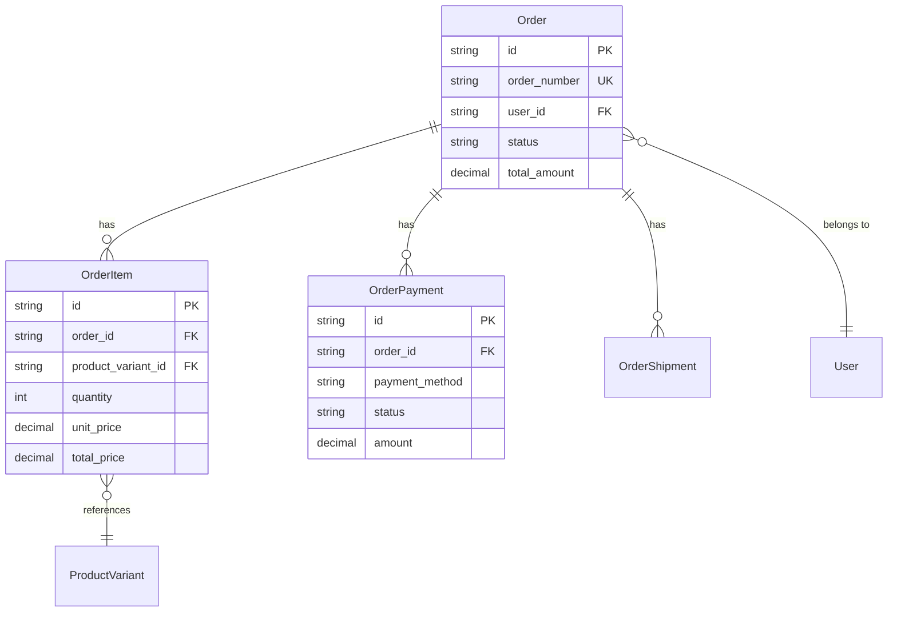
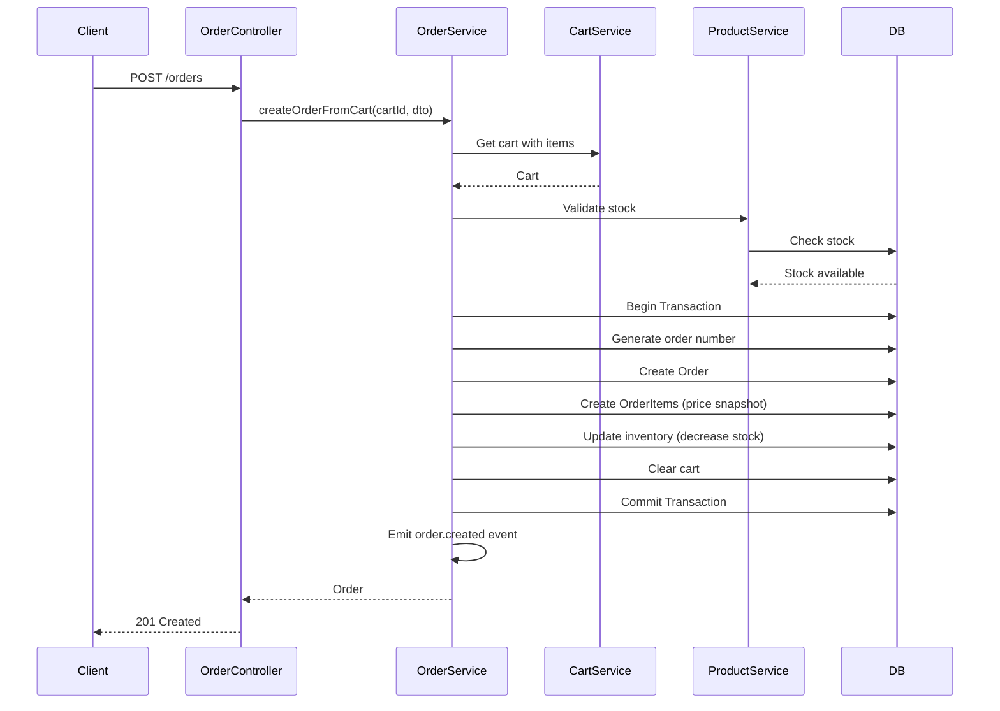
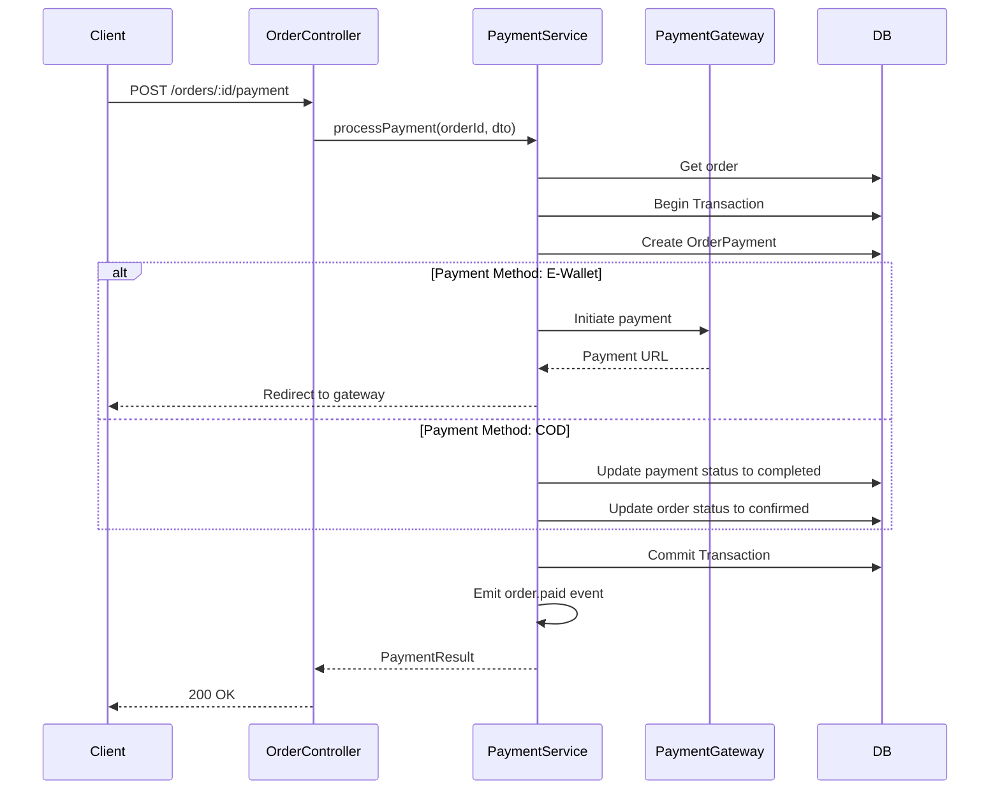

# Technical Design Document: Order Management Module (BE.02)

## 1. Overview

Module Order Management quản lý toàn bộ vòng đời của đơn hàng từ khi tạo đến khi hoàn thành, bao gồm xử lý thanh toán, quản lý trạng thái, tích hợp với các dịch vụ vận chuyển và tạo hóa đơn. Module này là trung tâm của hệ thống e-commerce, đảm bảo tính toàn vẹn dữ liệu và xử lý các giao dịch quan trọng.

**SRS Reference**: BE.02 - Quản lý Đơn hàng

## 2. Requirements

### 2.1 Functional Requirements

- **BE.02.1**: Tạo đơn hàng từ giỏ hàng với validation đầy đủ
- **BE.02.2**: Xử lý thanh toán qua các gateway (COD, Chuyển khoản, Ví điện tử)
- **BE.02.3**: Quản lý trạng thái đơn hàng với state machine
- **BE.02.4**: Cập nhật thông tin giao hàng và tracking
- **BE.02.5**: Hủy và hoàn tiền đơn hàng
- **BE.02.6**: Tạo hóa đơn và báo cáo

**User Stories:**
- As a customer, I want to create an order from my cart so that I can purchase items
- As a customer, I want to track my order status so that I know when it will arrive
- As an admin, I want to manage orders so that I can fulfill customer requests
- As an admin, I want to process refunds so that I can handle customer returns
- As a system, I want to automatically update inventory when orders are confirmed

### 2.2 Non-Functional Requirements

- **Performance**: 
  - Order creation < 2 seconds
  - Order listing pagination < 500ms
  - Payment processing timeout < 30 seconds
  - Support concurrent order creation
- **Security**: 
  - Order ownership validation (users can only access their orders)
  - Payment data encryption
  - Webhook signature validation
  - Transaction atomicity for order creation
- **Scalability**: 
  - Handle 1000+ orders per hour
  - Queue-based processing for async operations
  - Efficient order search and filtering
- **Consistency**: 
  - Atomic order creation (order + items + payment in transaction)
  - Inventory reservation before order confirmation
  - Price snapshot at order time (prevent price disputes)

## 3. Technical Design

### 3.1. Database Schema Changes (Sequelize)

#### 3.1.1 Order Entity

```typescript
import { Table, Column, Model, DataType, PrimaryKey, ForeignKey, BelongsTo, HasMany, Index, AllowNull, Default } from 'sequelize-typescript';
import { User } from 'src/user/user.entity';
import { OrderItem } from './order-item.entity';
import { OrderPayment } from './order-payment.entity';
import { OrderShipment } from './order-shipment.entity';

@Table({ tableName: 'tbl_order', timestamps: false })
export class Order extends Model<Order> {
  @PrimaryKey
  @Column({ type: DataType.STRING(36) })
  id!: string;

  @Unique
  @Index('idx_order_number')
  @Column({ type: DataType.STRING(50), allowNull: false })
  order_number!: string;

  @ForeignKey(() => User)
  @Index('idx_user_id')
  @Column({ type: DataType.STRING(36), allowNull: false })
  user_id!: string;

  @Default('pending')
  @Index('idx_status')
  @Column({ type: DataType.ENUM('pending', 'confirmed', 'processing', 'shipped', 'delivered', 'cancelled', 'refunded') })
  status!: string;

  @Column({ type: DataType.DECIMAL(12, 2), allowNull: false })
  subtotal!: number;

  @Default(0)
  @Column({ type: DataType.DECIMAL(12, 2) })
  tax_amount!: number;

  @Default(0)
  @Column({ type: DataType.DECIMAL(12, 2) })
  shipping_amount!: number;

  @Default(0)
  @Column({ type: DataType.DECIMAL(12, 2) })
  discount_amount!: number;

  @Column({ type: DataType.DECIMAL(12, 2), allowNull: false })
  total_amount!: number;

  @Default('VND')
  @Column({ type: DataType.STRING(3) })
  currency!: string;

  // Billing Information
  @Column({ type: DataType.STRING(255), allowNull: false })
  billing_name!: string;

  @Column({ type: DataType.STRING(255), allowNull: false })
  billing_email!: string;

  @AllowNull(true)
  @Column({ type: DataType.STRING(20) })
  billing_phone?: string;

  @Column({ type: DataType.TEXT, allowNull: false })
  billing_address!: string;

  // Shipping Information
  @Column({ type: DataType.STRING(255), allowNull: false })
  shipping_name!: string;

  @AllowNull(true)
  @Column({ type: DataType.STRING(20) })
  shipping_phone?: string;

  @Column({ type: DataType.TEXT, allowNull: false })
  shipping_address!: string;

  @AllowNull(true)
  @Column({ type: DataType.STRING(50) })
  shipping_method?: string;

  @AllowNull(true)
  @Column({ type: DataType.STRING(100) })
  shipping_tracking_number?: string;

  @AllowNull(true)
  @Column({ type: DataType.TEXT })
  notes?: string;

  @AllowNull(true)
  @Column({ type: DataType.TEXT })
  admin_notes?: string;

  @Column({ type: DataType.DATE, defaultValue: DataType.NOW })
  order_date!: Date;

  @AllowNull(true)
  @Column({ type: DataType.DATE })
  confirmed_at?: Date;

  @AllowNull(true)
  @Column({ type: DataType.DATE })
  shipped_at?: Date;

  @AllowNull(true)
  @Column({ type: DataType.DATE })
  delivered_at?: Date;

  @AllowNull(true)
  @Column({ type: DataType.DATE })
  cancelled_at?: Date;

  @Column({ type: DataType.DATE, defaultValue: DataType.NOW })
  created_at!: Date;

  @Column({ type: DataType.DATE, defaultValue: DataType.NOW })
  updated_at!: Date;

  @BelongsTo(() => User)
  user?: User;

  @HasMany(() => OrderItem)
  items?: OrderItem[];

  @HasMany(() => OrderPayment)
  payments?: OrderPayment[];

  @HasMany(() => OrderShipment)
  shipments?: OrderShipment[];
}
```

#### 3.1.2 Order Item Entity

```typescript
@Table({ tableName: 'tbl_order_item', timestamps: false })
export class OrderItem extends Model<OrderItem> {
  @PrimaryKey
  @Column({ type: DataType.STRING(36) })
  id!: string;

  @ForeignKey(() => Order)
  @Index('idx_order_id')
  @Column({ type: DataType.STRING(36), allowNull: false })
  order_id!: string;

  @ForeignKey(() => ProductVariant)
  @Index('idx_product_variant_id')
  @Column({ type: DataType.STRING(36), allowNull: false })
  product_variant_id!: string;

  @Column({ type: DataType.STRING(255), allowNull: false })
  product_name!: string;

  @Column({ type: DataType.JSON })
  variant_attributes!: Record<string, any>;

  @Column({ type: DataType.INTEGER, allowNull: false })
  quantity!: number;

  @Column({ type: DataType.DECIMAL(10, 2), allowNull: false })
  unit_price!: number;

  @Column({ type: DataType.DECIMAL(12, 2), allowNull: false })
  total_price!: number;

  @AllowNull(true)
  @Column({ type: DataType.STRING(100) })
  product_sku?: string;

  @AllowNull(true)
  @Column({ type: DataType.STRING(500) })
  product_image_url?: string;

  @Column({ type: DataType.DATE, defaultValue: DataType.NOW })
  created_at!: Date;

  @Column({ type: DataType.DATE, defaultValue: DataType.NOW })
  updated_at!: Date;

  @BelongsTo(() => Order)
  order?: Order;

  @BelongsTo(() => ProductVariant)
  productVariant?: ProductVariant;
}
```

#### 3.1.3 Order Payment Entity

```typescript
@Table({ tableName: 'tbl_order_payment', timestamps: false })
export class OrderPayment extends Model<OrderPayment> {
  @PrimaryKey
  @Column({ type: DataType.STRING(36) })
  id!: string;

  @ForeignKey(() => Order)
  @Index('idx_order_id')
  @Column({ type: DataType.STRING(36), allowNull: false })
  order_id!: string;

  @Index('idx_payment_method')
  @Column({ type: DataType.ENUM('credit_card', 'paypal', 'bank_transfer', 'cod', 'e_wallet'), allowNull: false })
  payment_method!: string;

  @AllowNull(true)
  @Column({ type: DataType.STRING(50) })
  payment_gateway?: string;

  @AllowNull(true)
  @Index('idx_gateway_transaction_id')
  @Column({ type: DataType.STRING(255) })
  gateway_transaction_id?: string;

  @Default('pending')
  @Index('idx_status')
  @Column({ type: DataType.ENUM('pending', 'processing', 'completed', 'failed', 'cancelled', 'refunded') })
  status!: string;

  @Column({ type: DataType.DECIMAL(12, 2), allowNull: false })
  amount!: number;

  @Default('VND')
  @Column({ type: DataType.STRING(3) })
  currency!: string;

  @Column({ type: DataType.JSON })
  payment_details?: Record<string, any>;

  @Column({ type: DataType.JSON })
  gateway_response?: Record<string, any>;

  @Default(0)
  @Column({ type: DataType.DECIMAL(12, 2) })
  refund_amount!: number;

  @AllowNull(true)
  @Column({ type: DataType.TEXT })
  refund_reason?: string;

  @AllowNull(true)
  @Column({ type: DataType.DATE })
  processed_at?: Date;

  @Column({ type: DataType.DATE, defaultValue: DataType.NOW })
  created_at!: Date;

  @Column({ type: DataType.DATE, defaultValue: DataType.NOW })
  updated_at!: Date;

  @BelongsTo(() => Order)
  order?: Order;
}
```

#### 3.1.4 ERD Diagram



### 3.2. Backend Implementation (NestJS)

#### 3.2.1 Module Structure

```
src/order/
├── order.entity.ts
├── order-item.entity.ts
├── order-payment.entity.ts
├── order-shipment.entity.ts
├── order.controller.ts
├── order.service.ts
├── payment.service.ts
├── order-state.service.ts
├── order.module.ts
├── order.providers.ts
├── dto/
│   ├── create-order.dto.ts
│   ├── update-order.dto.ts
│   ├── order-query.dto.ts
│   └── payment-request.dto.ts
├── enums/
│   ├── order-status.enum.ts
│   └── payment-status.enum.ts
└── guards/
    └── order-access.guard.ts
```

#### 3.2.2 API Endpoints

```typescript
@Controller('orders')
@ApiTags('orders')
@UseGuards(JwtAuthGuard)
export class OrderController {
  
  @Post()
  @ApiOperation({ summary: 'Create new order from cart' })
  async createOrder(@Body() createOrderDto: CreateOrderDto, @Req() req: Request): Promise<OrderDto>

  @Get()
  @ApiOperation({ summary: 'Get user orders with pagination' })
  async getOrders(@Query() queryDto: OrderQueryDto, @Req() req: Request): Promise<IPaginatedResult<OrderDto>>

  @Get(':id')
  @ApiOperation({ summary: 'Get order details' })
  @UseGuards(OrderAccessGuard)
  async getOrder(@Param('id') id: string): Promise<OrderDetailDto>

  @Put(':id/cancel')
  @ApiOperation({ summary: 'Cancel order' })
  @UseGuards(OrderAccessGuard)
  async cancelOrder(@Param('id') id: string, @Body() cancelDto: CancelOrderDto): Promise<OrderDto>

  @Post(':id/payment')
  @ApiOperation({ summary: 'Process payment for order' })
  @UseGuards(OrderAccessGuard)
  async processPayment(@Param('id') id: string, @Body() paymentDto: PaymentRequestDto): Promise<PaymentResultDto>
}

@Controller('admin/orders')
@ApiTags('admin-orders')
@UseGuards(JwtAuthGuard, RolesGuard)
@Roles('admin', 'staff')
export class AdminOrderController {
  
  @Get()
  @ApiOperation({ summary: 'Get all orders with advanced filtering' })
  async getAllOrders(@Query() queryDto: AdminOrderQueryDto): Promise<IPaginatedResult<OrderDto>>

  @Put(':id/status')
  @ApiOperation({ summary: 'Update order status' })
  async updateOrderStatus(@Param('id') id: string, @Body() statusDto: UpdateOrderStatusDto): Promise<OrderDto>

  @Post(':id/refund')
  @ApiOperation({ summary: 'Process refund for order' })
  async processRefund(@Param('id') id: string, @Body() refundDto: RefundRequestDto): Promise<RefundResultDto>
}
```

#### 3.2.3 Service Logic

```typescript
@Injectable()
export class OrderService extends CrudService<Order> {
  constructor() {
    super(Order);
  }

  async createOrderFromCart(cartId: string, orderData: CreateOrderDto): Promise<Order> {
    const t = await this.transaction();
    try {
      // 1. Get cart with items
      const cart = await Cart.findByPk(cartId, {
        include: [{ model: CartItem, include: [ProductVariant] }],
        transaction: t
      });

      if (!cart || !cart.items || cart.items.length === 0) {
        throw new BadRequestException('Cart is empty');
      }

      // 2. Validate stock availability
      for (const cartItem of cart.items) {
        const variant = cartItem.productVariant;
        if (!variant || variant.stock_quantity < cartItem.quantity) {
          throw new InsufficientStockException(
            variant?.name || 'Product',
            variant?.stock_quantity || 0,
            cartItem.quantity
          );
        }
      }

      // 3. Generate order number
      const orderNumber = await this.generateOrderNumber();

      // 4. Calculate totals
      const totals = await this.calculateOrderTotals(cart.items, orderData.shippingMethod);

      // 5. Create order
      const order = await Order.create({
        id: uuidv4(),
        order_number: orderNumber,
        user_id: cart.user_id || orderData.userId,
        status: 'pending',
        ...totals,
        billing_name: orderData.billingAddress.name,
        billing_email: orderData.billingAddress.email,
        billing_phone: orderData.billingAddress.phone,
        billing_address: JSON.stringify(orderData.billingAddress),
        shipping_name: orderData.shippingAddress.name,
        shipping_phone: orderData.shippingAddress.phone,
        shipping_address: JSON.stringify(orderData.shippingAddress),
        shipping_method: orderData.shippingMethod,
        notes: orderData.notes
      }, { transaction: t });

      // 6. Create order items (with price snapshot)
      const orderItems = await Promise.all(
        cart.items.map(cartItem => OrderItem.create({
          id: uuidv4(),
          order_id: order.id,
          product_variant_id: cartItem.product_variant_id,
          product_name: cartItem.productVariant?.product?.name || 'Unknown',
          variant_attributes: cartItem.productVariant?.attributes || {},
          quantity: cartItem.quantity,
          unit_price: cartItem.unit_price_at_add, // Price snapshot
          total_price: cartItem.unit_price_at_add * cartItem.quantity,
          product_sku: cartItem.productVariant?.sku,
          product_image_url: cartItem.productVariant?.images?.[0]?.image_url
        }, { transaction: t }))
      );

      // 7. Reserve inventory
      for (const cartItem of cart.items) {
        await ProductVariant.update(
          { stock_quantity: sequelize.literal(`stock_quantity - ${cartItem.quantity}`) },
          { where: { id: cartItem.product_variant_id }, transaction: t }
        );
      }

      // 8. Clear cart
      await CartItem.destroy({ where: { cart_id: cartId }, transaction: t });

      await t.commit();

      // 9. Emit order created event
      this.eventEmitter.emit('order.created', { order });

      return order;
    } catch (error) {
      await t.rollback();
      throw error;
    }
  }

  async updateOrderStatus(orderId: string, newStatus: OrderStatus, notes?: string): Promise<Order> {
    const order = await Order.findByPk(orderId);
    if (!order) {
      throw new OrderNotFoundException(orderId);
    }

    // Validate status transition
    if (!this.orderStateService.canTransition(order.status, newStatus)) {
      throw new InvalidOrderTransitionException(order.status, newStatus);
    }

    const t = await this.transaction();
    try {
      // Update order status
      await order.update({ status: newStatus }, { transaction: t });

      // Update timestamps based on status
      const updateData: any = {};
      if (newStatus === 'confirmed') updateData.confirmed_at = new Date();
      if (newStatus === 'shipped') updateData.shipped_at = new Date();
      if (newStatus === 'delivered') updateData.delivered_at = new Date();
      if (newStatus === 'cancelled') updateData.cancelled_at = new Date();

      if (Object.keys(updateData).length > 0) {
        await order.update(updateData, { transaction: t });
      }

      // Create order history
      await OrderHistory.create({
        id: uuidv4(),
        order_id: orderId,
        action: `status_changed_to_${newStatus}`,
        from_status: order.status,
        to_status: newStatus,
        notes,
        performed_by_type: 'admin'
      }, { transaction: t });

      await t.commit();

      // Emit status change event
      this.eventEmitter.emit('order.status.changed', { order, newStatus });

      return order.reload();
    } catch (error) {
      await t.rollback();
      throw error;
    }
  }
}

@Injectable()
export class PaymentService {
  async processPayment(orderId: string, paymentData: PaymentRequestDto): Promise<PaymentResult> {
    const order = await Order.findByPk(orderId, {
      include: [OrderPayment]
    });

    if (!order) {
      throw new OrderNotFoundException(orderId);
    }

    const t = await this.transaction();
    try {
      // Create payment record
      const payment = await OrderPayment.create({
        id: uuidv4(),
        order_id: orderId,
        payment_method: paymentData.paymentMethod,
        payment_gateway: paymentData.gateway,
        amount: order.total_amount,
        status: 'processing'
      }, { transaction: t });

      // Process based on payment method
      let result: PaymentResult;
      switch (paymentData.paymentMethod) {
        case 'cod':
          result = await this.processCODPayment(order, payment);
          break;
        case 'bank_transfer':
          result = await this.processBankTransfer(order, payment);
          break;
        case 'e_wallet':
          result = await this.processEWalletPayment(order, payment, paymentData);
          break;
        default:
          throw new BadRequestException('Unsupported payment method');
      }

      // Update payment status
      await payment.update({
        status: result.success ? 'completed' : 'failed',
        gateway_transaction_id: result.transactionId,
        gateway_response: result.gatewayResponse,
        processed_at: result.success ? new Date() : null
      }, { transaction: t });

      // Update order status if payment successful
      if (result.success) {
        await order.update({ status: 'confirmed' }, { transaction: t });
        this.eventEmitter.emit('order.paid', { order, payment });
      }

      await t.commit();
      return result;
    } catch (error) {
      await t.rollback();
      throw error;
    }
  }
}
```

#### 3.2.4 Data Access Patterns

- Use transactions for all order creation/modification operations
- Use `include` for eager loading (items, payments, shipments)
- Use `attributes` to limit fields in listings
- Implement proper indexing for order queries
- Use price snapshot in OrderItem (unit_price) to prevent disputes

### 3.3. Logic Flow

#### 3.3.1 Create Order Flow



#### 3.3.2 Payment Processing Flow



### 3.4. Security & Performance

#### 3.4.1 Authentication/Authorization

- **JwtAuthGuard**: Required for all order endpoints
- **OrderAccessGuard**: Users can only access their own orders (Admin exception)
- **RolesGuard**: Admin/Staff can manage all orders

#### 3.4.2 Validation

- DTO validation using `class-validator`
- Stock validation before order creation
- Order amount validation (min/max)
- Payment method validation
- Status transition validation (state machine)

#### 3.4.3 Caching Strategy

- Cache order details by ID (TTL: 30 minutes)
- Cache user order lists (TTL: 15 minutes)
- Invalidate cache on order updates
- Use Redis for distributed caching

#### 3.4.4 Database Optimization

- Indexes on: `order_number`, `user_id`, `status`, `order_date`
- Use transactions for atomic operations
- Implement pagination for order listings
- Use read replicas for analytics queries

## 4. Testing Plan

### 4.1 Unit Tests

- Order service business logic
- Payment processing logic
- Order state machine transitions
- Validation rules
- Calculation accuracy
- Order number generation

### 4.2 Integration Tests

- Order creation flow with transactions
- Payment gateway integration
- Inventory update on order creation
- Order status updates
- Event handling
- Queue processing

### 4.3 E2E Tests

- Complete order workflow (cart → order → payment → fulfillment)
- Payment processing flows (COD, Bank Transfer, E-Wallet)
- Order cancellation and refund
- Admin order management
- Order tracking

## 5. Alternatives Considered

### 5.1 Order Status Management

**Option A: State Machine (current)**
- Pros: Enforces valid transitions, prevents invalid states, clear business rules
- Cons: More complex implementation
- **Chosen**: Better data integrity and maintainability

**Option B: Simple enum with validation**
- Pros: Simpler implementation
- Cons: Easy to make mistakes, harder to enforce rules
- **Rejected**: Too error-prone for critical business logic

### 5.2 Inventory Management on Order Creation

**Option A: Reserve immediately (current)**
- Pros: Prevents overselling, immediate stock deduction
- Cons: Need to handle reservation expiry
- **Chosen**: Better user experience, prevents stock issues

**Option B: Reserve on payment confirmation**
- Pros: Simpler, no reservation expiry needed
- Cons: Risk of overselling, stock may be gone by payment time
- **Rejected**: Too risky for e-commerce

**Option C: Check-only, reserve on payment**
- Pros: Simple, no reservations to manage
- Cons: Race conditions, overselling risk
- **Rejected**: Unreliable for concurrent orders

### 5.3 Payment Processing

**Option A: Synchronous processing (current)**
- Pros: Immediate feedback, simpler flow
- Cons: Slower response time for gateway redirects
- **Chosen**: Better UX for most payment methods

**Option B: Asynchronous with webhooks**
- Pros: Faster response, better for high volume
- Cons: More complex, need webhook handling
- **Considered**: May implement for specific gateways

### 5.4 Price Snapshot Strategy

**Option A: Snapshot in OrderItem (current)**
- Pros: Price consistency, prevents disputes, audit trail
- Cons: Slightly more storage
- **Chosen**: Critical for e-commerce, prevents customer disputes

**Option B: Reference current price**
- Pros: Less storage, always current
- Cons: Price can change, disputes, inconsistent orders
- **Rejected**: Unacceptable for production

## 6. Implementation Checklist

- [ ] Create Order entity with Sequelize decorators
- [ ] Create OrderItem entity with price snapshot
- [ ] Create OrderPayment entity
- [ ] Create OrderShipment entity (if needed)
- [ ] Create migration files for all tables
- [ ] Implement OrderService with transaction handling
- [ ] Implement PaymentService with gateway integration
- [ ] Implement OrderStateService (state machine)
- [ ] Create DTOs with validation
- [ ] Implement OrderController (customer endpoints)
- [ ] Implement AdminOrderController
- [ ] Implement OrderAccessGuard
- [ ] Add inventory reservation logic
- [ ] Implement order number generation
- [ ] Add event emitters for order events
- [ ] Implement Redis caching
- [ ] Add payment gateway integrations (COD, Bank Transfer, E-Wallet)
- [ ] Write unit tests
- [ ] Write integration tests
- [ ] Write E2E tests
