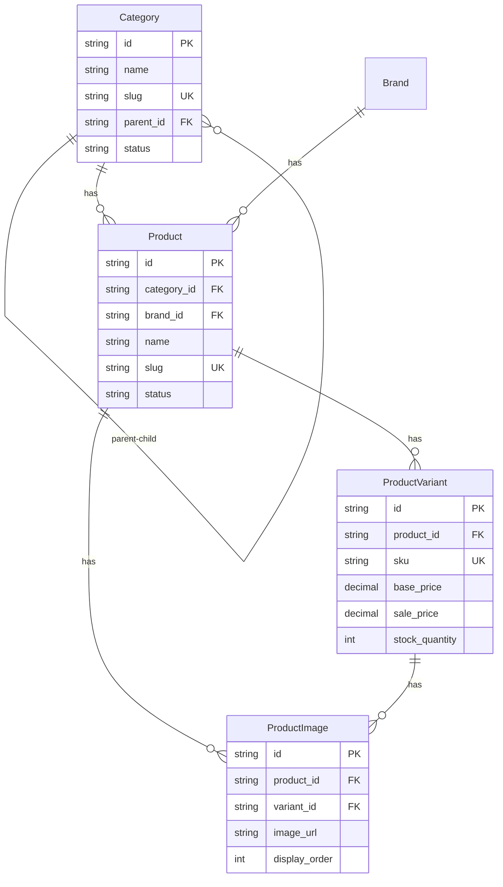
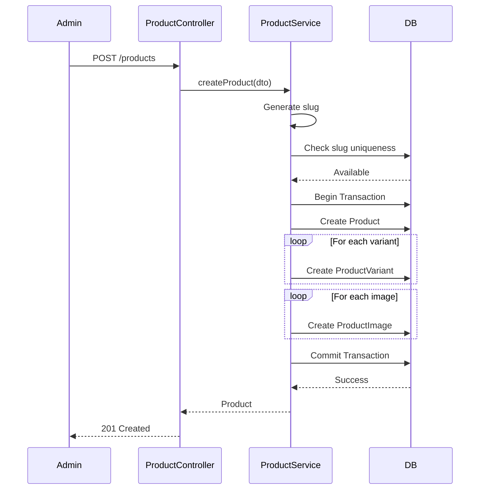
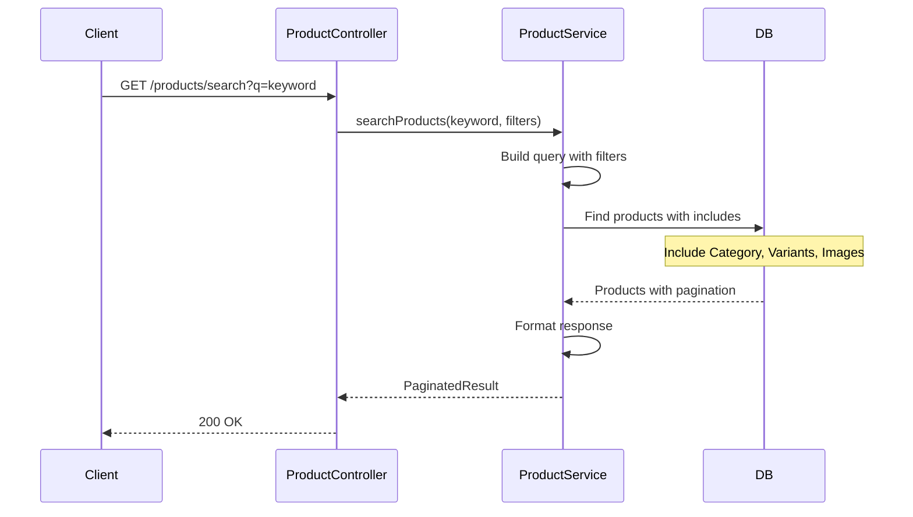

# Technical Design Document: Product Management Module (BE.01)

## 1. Overview

Module Product Management cung cấp đầy đủ chức năng quản lý sản phẩm cho hệ thống e-commerce, bao gồm quản lý danh mục, sản phẩm, biến thể, giá cả, tồn kho và khuyến mãi. Module này là nền tảng cho việc quản lý catalog sản phẩm và hỗ trợ các tính năng tìm kiếm, lọc, và hiển thị sản phẩm cho khách hàng.

**SRS Reference**: BE.01 - Quản lý Sản phẩm

## 2. Requirements

### 2.1 Functional Requirements

- **BE.01.1**: Quản lý danh mục sản phẩm (CRUD, hỗ trợ đa cấp)
- **BE.01.2**: Quản lý sản phẩm (CRUD với SKU, mô tả, hình ảnh, trạng thái)
- **BE.01.3**: Quản lý thuộc tính và biến thể sản phẩm
- **BE.01.4**: Quản lý giá (giá gốc, giá khuyến mãi)
- **BE.01.5**: Quản lý tồn kho (nhập/cập nhật, tự động giảm/tăng)
- **BE.01.6**: Quản lý khuyến mãi (mã giảm giá, điều kiện áp dụng)

**User Stories:**
- As an admin, I want to create and manage product categories so that I can organize products effectively
- As an admin, I want to add products with variants so that I can sell products with different attributes
- As an admin, I want to manage inventory levels so that I can track stock availability
- As a customer, I want to search and filter products so that I can find what I'm looking for
- As a customer, I want to see product details with images so that I can make informed purchase decisions

### 2.2 Non-Functional Requirements

- **Performance**: 
  - Product search response time < 500ms
  - Product listing pagination < 300ms
  - Support full-text search on product name and description
  - Handle up to 10,000 products efficiently
- **Security**: 
  - Role-based access control (Admin/Staff can modify, Customers read-only)
  - Input validation for all product data
  - File upload validation for images (size, type, dimensions)
  - SKU uniqueness validation
- **Scalability**: 
  - Support large product catalogs (100K+ products)
  - Efficient category hierarchy queries
  - Caching for frequently accessed data
- **Consistency**: 
  - Stock updates must be atomic (use transactions)
  - Category hierarchy validation (prevent circular references)
  - Price history tracking (optional)

## 3. Technical Design

### 3.1. Database Schema Changes (Sequelize)

#### 3.1.1 Category Entity

```typescript
import { Table, Column, Model, DataType, PrimaryKey, ForeignKey, BelongsTo, HasMany, Index, AllowNull, Default } from 'sequelize-typescript';

@Table({ tableName: 'tbl_category', timestamps: false })
export class Category extends Model<Category> {
  @PrimaryKey
  @Column({ type: DataType.STRING(36) })
  id!: string;

  @Column({ type: DataType.STRING(255), allowNull: false })
  name!: string;

  @Unique
  @Index('idx_slug')
  @Column({ type: DataType.STRING(255), allowNull: false })
  slug!: string;

  @AllowNull(true)
  @ForeignKey(() => Category)
  @Index('idx_parent_id')
  @Column({ type: DataType.STRING(36) })
  parent_id?: string;

  @AllowNull(true)
  @Column({ type: DataType.TEXT })
  description?: string;

  @AllowNull(true)
  @Column({ type: DataType.STRING(500) })
  image_url?: string;

  @Default(0)
  @Column({ type: DataType.INTEGER })
  display_order!: number;

  @Default('active')
  @Index('idx_status')
  @Column({ type: DataType.ENUM('active', 'inactive') })
  status!: string;

  @Column({ type: DataType.DATE, defaultValue: DataType.NOW })
  created_at!: Date;

  @Column({ type: DataType.DATE, defaultValue: DataType.NOW })
  updated_at!: Date;

  @BelongsTo(() => Category, { foreignKey: 'parent_id', as: 'parent' })
  parent?: Category;

  @HasMany(() => Category, { foreignKey: 'parent_id', as: 'children' })
  children?: Category[];

  @HasMany(() => Product)
  products?: Product[];
}
```

#### 3.1.2 Product Entity

```typescript
@Table({ tableName: 'tbl_product', timestamps: false })
export class Product extends Model<Product> {
  @PrimaryKey
  @Column({ type: DataType.STRING(36) })
  id!: string;

  @ForeignKey(() => Category)
  @Index('idx_category_id')
  @Column({ type: DataType.STRING(36), allowNull: false })
  category_id!: string;

  @AllowNull(true)
  @ForeignKey(() => Brand)
  @Column({ type: DataType.STRING(36) })
  brand_id?: string;

  @Column({ type: DataType.STRING(255), allowNull: false })
  name!: string;

  @Unique
  @Index('idx_slug')
  @Column({ type: DataType.STRING(255), allowNull: false })
  slug!: string;

  @AllowNull(true)
  @Column({ type: DataType.STRING(50) })
  sku_prefix?: string;

  @AllowNull(true)
  @Column({ type: DataType.TEXT })
  short_description?: string;

  @AllowNull(true)
  @Column({ type: DataType.TEXT('long') })
  full_description?: string;

  @Default('draft')
  @Index('idx_status')
  @Column({ type: DataType.ENUM('published', 'draft', 'archived') })
  status!: string;

  @Column({ type: DataType.DATE, defaultValue: DataType.NOW })
  created_at!: Date;

  @Column({ type: DataType.DATE, defaultValue: DataType.NOW })
  updated_at!: Date;

  @BelongsTo(() => Category)
  category?: Category;

  @BelongsTo(() => Brand)
  brand?: Brand;

  @HasMany(() => ProductVariant)
  variants?: ProductVariant[];

  @HasMany(() => ProductImage)
  images?: ProductImage[];
}
```

#### 3.1.3 Product Variant Entity

```typescript
@Table({ tableName: 'tbl_product_variant', timestamps: false })
export class ProductVariant extends Model<ProductVariant> {
  @PrimaryKey
  @Column({ type: DataType.STRING(36) })
  id!: string;

  @ForeignKey(() => Product)
  @Index('idx_product_id')
  @Column({ type: DataType.STRING(36), allowNull: false })
  product_id!: string;

  @Unique
  @Index('idx_sku')
  @Column({ type: DataType.STRING(100), allowNull: false })
  sku!: string;

  @Column({ type: DataType.JSON })
  attributes!: Record<string, any>;

  @Column({ type: DataType.DECIMAL(10, 2), allowNull: false })
  base_price!: number;

  @AllowNull(true)
  @Column({ type: DataType.DECIMAL(10, 2) })
  sale_price?: number;

  @Default(0)
  @Column({ type: DataType.INTEGER })
  stock_quantity!: number;

  @Default(5)
  @Column({ type: DataType.INTEGER })
  low_stock_threshold!: number;

  @Default(false)
  @Column({ type: DataType.BOOLEAN })
  allow_backorder!: boolean;

  @AllowNull(true)
  @Column({ type: DataType.DECIMAL(8, 2) })
  weight?: number;

  @Column({ type: DataType.JSON })
  dimensions?: { length: number; width: number; height: number };

  @Default('active')
  @Index('idx_status')
  @Column({ type: DataType.ENUM('active', 'inactive') })
  status!: string;

  @Column({ type: DataType.DATE, defaultValue: DataType.NOW })
  created_at!: Date;

  @Column({ type: DataType.DATE, defaultValue: DataType.NOW })
  updated_at!: Date;

  @BelongsTo(() => Product)
  product?: Product;

  @HasMany(() => ProductImage)
  images?: ProductImage[];
}
```

#### 3.1.4 Product Image Entity

```typescript
@Table({ tableName: 'tbl_product_image', timestamps: false })
export class ProductImage extends Model<ProductImage> {
  @PrimaryKey
  @Column({ type: DataType.STRING(36) })
  id!: string;

  @ForeignKey(() => Product)
  @Index('idx_product_id')
  @Column({ type: DataType.STRING(36), allowNull: false })
  product_id!: string;

  @AllowNull(true)
  @ForeignKey(() => ProductVariant)
  @Index('idx_variant_id')
  @Column({ type: DataType.STRING(36) })
  variant_id?: string;

  @Column({ type: DataType.STRING(500), allowNull: false })
  image_url!: string;

  @AllowNull(true)
  @Column({ type: DataType.STRING(255) })
  alt_text?: string;

  @Default(0)
  @Column({ type: DataType.INTEGER })
  display_order!: number;

  @Default(false)
  @Column({ type: DataType.BOOLEAN })
  is_primary!: boolean;

  @Column({ type: DataType.DATE, defaultValue: DataType.NOW })
  created_at!: Date;

  @BelongsTo(() => Product)
  product?: Product;

  @BelongsTo(() => ProductVariant)
  variant?: ProductVariant;
}
```

#### 3.1.5 ERD Diagram



### 3.2. Backend Implementation (NestJS)

#### 3.2.1 Module Structure

```
src/product/
├── category/
│   ├── category.entity.ts
│   ├── category.controller.ts
│   ├── category.service.ts
│   ├── category.module.ts
│   ├── category.providers.ts
│   └── dto/
│       ├── create-category.dto.ts
│       ├── update-category.dto.ts
│       └── category-query.dto.ts
├── product/
│   ├── product.entity.ts
│   ├── product.controller.ts
│   ├── product.service.ts
│   ├── product.module.ts
│   ├── product.providers.ts
│   └── dto/
│       ├── create-product.dto.ts
│       ├── update-product.dto.ts
│       ├── product-query.dto.ts
│       └── product-variant.dto.ts
├── inventory/
│   ├── inventory.service.ts
│   └── dto/
│       ├── inventory-update.dto.ts
│       └── stock-adjustment.dto.ts
└── product.module.ts
```

#### 3.2.2 API Endpoints

```typescript
// Category Controller
@Controller('categories')
@ApiTags('categories')
export class CategoryController {
  
  @Get()
  @ApiOperation({ summary: 'Get all categories' })
  async findAll(@Query() query: CategoryQueryDto): Promise<Category[]>

  @Get('tree')
  @ApiOperation({ summary: 'Get category tree' })
  async getCategoryTree(): Promise<Category[]>

  @Get(':id')
  @ApiOperation({ summary: 'Get category by ID' })
  async findOne(@Param('id') id: string): Promise<Category>

  @Post()
  @ApiOperation({ summary: 'Create new category' })
  @UseGuards(JwtAuthGuard, RolesGuard)
  @Roles('admin', 'staff')
  async create(@Body() createCategoryDto: CreateCategoryDto): Promise<Category>

  @Put(':id')
  @ApiOperation({ summary: 'Update category' })
  @UseGuards(JwtAuthGuard, RolesGuard)
  @Roles('admin', 'staff')
  async update(@Param('id') id: string, @Body() updateCategoryDto: UpdateCategoryDto): Promise<Category>

  @Delete(':id')
  @ApiOperation({ summary: 'Delete category' })
  @UseGuards(JwtAuthGuard, RolesGuard)
  @Roles('admin')
  async remove(@Param('id') id: string): Promise<void>
}

// Product Controller
@Controller('products')
@ApiTags('products')
export class ProductController {
  
  @Get()
  @ApiOperation({ summary: 'Get products with pagination and filters' })
  async findAll(@Query() query: ProductQueryDto): Promise<IPaginatedResult<Product>>

  @Get('search')
  @ApiOperation({ summary: 'Search products by keyword' })
  async search(@Query('q') keyword: string, @Query() query: ProductQueryDto): Promise<IPaginatedResult<Product>>

  @Get(':id')
  @ApiOperation({ summary: 'Get product by ID with variants' })
  async findOne(@Param('id') id: string): Promise<Product>

  @Post()
  @ApiOperation({ summary: 'Create new product' })
  @UseGuards(JwtAuthGuard, RolesGuard)
  @Roles('admin', 'staff')
  async create(@Body() createProductDto: CreateProductDto): Promise<Product>

  @Put(':id')
  @ApiOperation({ summary: 'Update product' })
  @UseGuards(JwtAuthGuard, RolesGuard)
  @Roles('admin', 'staff')
  async update(@Param('id') id: string, @Body() updateProductDto: UpdateProductDto): Promise<Product>

  @Delete(':id')
  @ApiOperation({ summary: 'Delete product' })
  @UseGuards(JwtAuthGuard, RolesGuard)
  @Roles('admin')
  async remove(@Param('id') id: string): Promise<void>

  @Post(':id/variants')
  @ApiOperation({ summary: 'Add product variant' })
  @UseGuards(JwtAuthGuard, RolesGuard)
  @Roles('admin', 'staff')
  async addVariant(@Param('id') productId: string, @Body() variantDto: ProductVariantDto): Promise<ProductVariant>

  @Put(':id/variants/:variantId')
  @ApiOperation({ summary: 'Update product variant' })
  @UseGuards(JwtAuthGuard, RolesGuard)
  @Roles('admin', 'staff')
  async updateVariant(@Param('variantId') variantId: string, @Body() variantDto: ProductVariantDto): Promise<ProductVariant>
}
```

#### 3.2.3 Service Logic

```typescript
@Injectable()
export class ProductService extends CrudService<Product> {
  constructor() {
    super(Product);
  }

  async createProduct(createProductDto: CreateProductDto): Promise<Product> {
    const t = await this.transaction();
    try {
      // Generate slug from name
      const slug = this.generateSlug(createProductDto.name);
      
      // Check slug uniqueness
      const existing = await Product.findOne({ where: { slug }, transaction: t });
      if (existing) {
        throw new ConflictException('Product with this slug already exists');
      }

      const product = await Product.create({
        id: uuidv4(),
        ...createProductDto,
        slug
      }, { transaction: t });

      await t.commit();
      return product;
    } catch (error) {
      await t.rollback();
      throw error;
    }
  }

  async searchProducts(keyword: string, filters: ProductQueryDto): Promise<IPaginatedResult<Product>> {
    const { Op } = require('sequelize');
    const where: any = {
      status: 'published'
    };

    // Full-text search on name and description
    if (keyword) {
      where[Op.or] = [
        { name: { [Op.like]: `%${keyword}%` } },
        { short_description: { [Op.like]: `%${keyword}%` } }
      ];
    }

    // Category filter
    if (filters.categoryId) {
      where.category_id = filters.categoryId;
    }

    // Price range filter
    if (filters.minPrice || filters.maxPrice) {
      // This requires join with ProductVariant
      // Implementation depends on query complexity
    }

    const { limit = 20, offset = 0 } = filters;
    
    const { rows, count } = await Product.findAndCountAll({
      where,
      include: [
        { model: Category },
        { model: ProductVariant, where: { status: 'active' }, required: false },
        { model: ProductImage, where: { is_primary: true }, required: false, limit: 1 }
      ],
      limit,
      offset,
      order: [['created_at', 'DESC']]
    });

    return {
      data: rows,
      total: count,
      limit,
      offset
    };
  }

  async updateStock(variantId: string, quantity: number, operation: 'increase' | 'decrease'): Promise<void> {
    const t = await this.transaction();
    try {
      const variant = await ProductVariant.findByPk(variantId, { transaction: t });
      if (!variant) {
        throw new NotFoundException('Product variant not found');
      }

      const newQuantity = operation === 'increase' 
        ? variant.stock_quantity + quantity
        : variant.stock_quantity - quantity;

      if (newQuantity < 0 && !variant.allow_backorder) {
        throw new BadRequestException('Insufficient stock');
      }

      await variant.update({ stock_quantity: newQuantity }, { transaction: t });
      await t.commit();
    } catch (error) {
      await t.rollback();
      throw error;
    }
  }
}

@Injectable()
export class CategoryService extends CrudService<Category> {
  constructor() {
    super(Category);
  }

  async getCategoryTree(): Promise<Category[]> {
    // Get all root categories (no parent)
    const rootCategories = await Category.findAll({
      where: { parent_id: null },
      include: [{ model: Category, as: 'children', required: false }],
      order: [['display_order', 'ASC']]
    });

    // Recursively load children
    const loadChildren = async (category: Category): Promise<Category> => {
      const children = await Category.findAll({
        where: { parent_id: category.id },
        order: [['display_order', 'ASC']]
      });

      category.children = await Promise.all(children.map(loadChildren));
      return category;
    };

    return Promise.all(rootCategories.map(loadChildren));
  }

  async validateCategoryHierarchy(categoryId: string, parentId: string): Promise<boolean> {
    // Prevent circular references
    if (categoryId === parentId) {
      return false;
    }

    // Check if parentId is a descendant of categoryId
    const checkDescendant = async (id: string, targetId: string): Promise<boolean> => {
      const category = await Category.findByPk(id);
      if (!category || !category.parent_id) {
        return false;
      }
      if (category.parent_id === targetId) {
        return true;
      }
      return checkDescendant(category.parent_id, targetId);
    };

    return !(await checkDescendant(parentId, categoryId));
  }
}
```

#### 3.2.4 Data Access Patterns

- Use Sequelize transactions for product creation (product + variants + images)
- Use `include` for eager loading relationships (category, variants, images)
- Use `attributes` to select only needed fields for listings
- Implement full-text search using `Op.like` or MySQL FULLTEXT index
- Use pagination with `findAndCountAll` for product listings

### 3.3. Logic Flow

#### 3.3.1 Create Product Flow



#### 3.3.2 Search Products Flow



### 3.4. Security & Performance

#### 3.4.1 Authentication/Authorization

- **JwtAuthGuard**: Required for create/update/delete operations
- **RolesGuard**: Admin and Staff can modify, Customers read-only
- **Permission-based**: Staff permissions can be granular (e.g., only manage inventory)

#### 3.4.2 Validation

- DTO validation using `class-validator` decorators
- SKU uniqueness validation
- Category hierarchy validation (prevent circular references)
- File upload validation (image size, type, dimensions)
- Slug uniqueness validation

#### 3.4.3 Caching Strategy

- **Category Tree**: Cache in Redis (TTL: 1 hour)
- **Product Search Results**: Cache with query hash as key (TTL: 15 minutes)
- **Product Details**: Cache by product ID (TTL: 30 minutes)
- **Invalidation**: Clear cache on product/category updates

#### 3.4.4 Database Optimization

- Indexes on: `category_id`, `status`, `slug`, `sku`, `parent_id`
- Full-text search index on `name` and `short_description`
- Composite indexes for common query patterns
- Use `attributes` to limit selected fields in listings

## 4. Testing Plan

### 4.1 Unit Tests

- Product service business logic (create, update, delete)
- Category service hierarchy management
- Stock update logic
- Slug generation
- Search query building
- DTO validation

### 4.2 Integration Tests

- API endpoints functionality
- Database operations with transactions
- Category tree building
- Product search with filters
- File upload handling
- Stock update atomicity

### 4.3 E2E Tests

- Complete product creation flow
- Product search and filtering
- Category hierarchy management
- Stock update scenarios
- Concurrent stock updates

## 5. Alternatives Considered

### 5.1 Product Variant Storage

**Option A: JSON attributes (current)**
- Pros: Flexible, easy to add new attributes, simple schema
- Cons: Harder to query/filter by attributes, no type safety
- **Chosen**: Better for e-commerce with varying product types

**Option B: EAV (Entity-Attribute-Value) model**
- Pros: Queryable, type-safe, normalized
- Cons: Complex queries, performance overhead, harder to maintain
- **Rejected**: Too complex for current needs

**Option C: Separate tables per product type**
- Pros: Type-safe, optimized queries
- Cons: Schema changes needed for new types, harder to maintain
- **Rejected**: Not flexible enough

### 5.2 Category Hierarchy

**Option A: Adjacency list (parent_id) - current**
- Pros: Simple, easy to implement, good for small hierarchies
- Cons: N+1 queries for tree, recursive queries needed
- **Chosen**: Simple and sufficient for most use cases

**Option B: Closure table**
- Pros: Fast tree queries, easy to get all descendants
- Cons: More storage, complex updates
- **Rejected**: Overkill for current requirements

**Option C: Nested set model**
- Pros: Fast queries for subtrees
- Cons: Complex updates, not suitable for frequent changes
- **Rejected**: Categories don't change frequently enough to justify complexity

### 5.3 Search Implementation

**Option A: MySQL LIKE queries (current)**
- Pros: Simple, no additional infrastructure
- Cons: Slower on large datasets, limited features
- **Chosen**: Good enough for MVP, can upgrade later

**Option B: Elasticsearch**
- Pros: Fast, powerful search features, faceted search
- Cons: Additional infrastructure, complexity, cost
- **Rejected**: Can be added later if needed

**Option C: MySQL FULLTEXT index**
- Pros: Better than LIKE, native MySQL feature
- Cons: Limited features compared to Elasticsearch
- **Considered**: May implement in future if LIKE becomes bottleneck

## 6. Implementation Checklist

- [ ] Create Category entity with Sequelize decorators
- [ ] Create Product entity with relationships
- [ ] Create ProductVariant entity
- [ ] Create ProductImage entity
- [ ] Create migration files for all tables
- [ ] Implement CategoryService with tree building
- [ ] Implement ProductService with CRUD operations
- [ ] Implement search functionality
- [ ] Create DTOs with validation
- [ ] Implement CategoryController
- [ ] Implement ProductController
- [ ] Add file upload handling for images
- [ ] Implement stock management service
- [ ] Add Redis caching
- [ ] Implement category hierarchy validation
- [ ] Add full-text search indexes
- [ ] Write unit tests
- [ ] Write integration tests
- [ ] Write E2E tests
