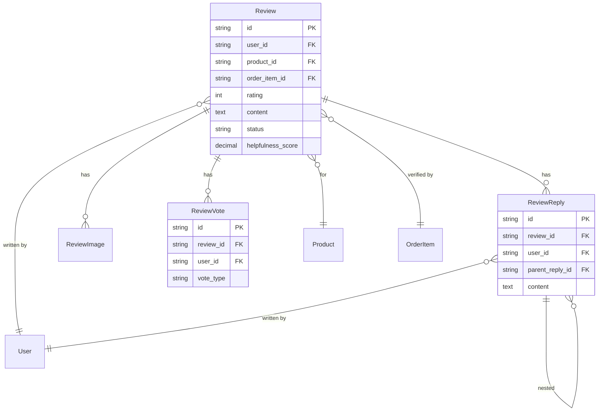
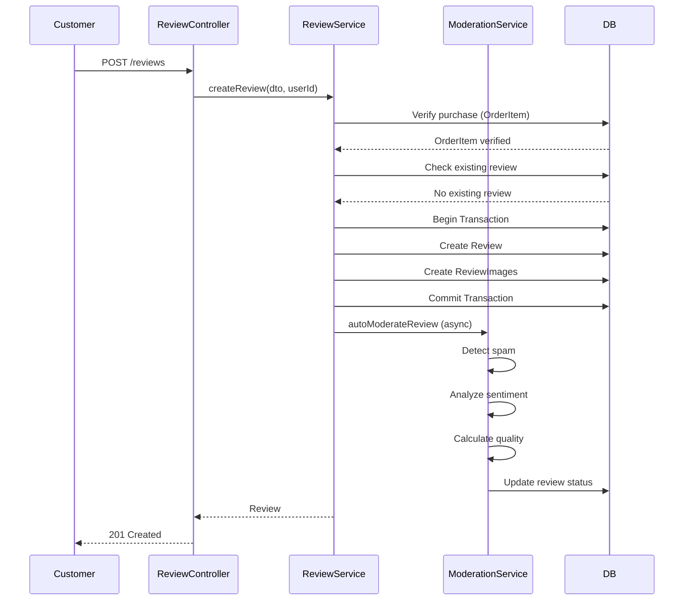
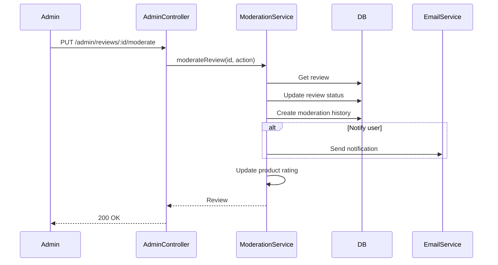

# Technical Design Document: Review Management Module (BE.05)

## 1. Overview

Module Review Management quản lý hệ thống đánh giá và bình luận sản phẩm, bao gồm kiểm duyệt tự động và thủ công, phân tích sentiment, và xây dựng hệ thống reputation cho sản phẩm. Module này đảm bảo chỉ những khách hàng đã mua sản phẩm mới có thể đánh giá, và cung cấp công cụ để quản lý chất lượng đánh giá.

**SRS Reference**: BE.05 - Quản lý Đánh giá và Bình luận

## 2. Requirements

### 2.1 Functional Requirements

- **BE.05.1**: Khách hàng đã mua sản phẩm có thể đánh giá và bình luận
- **BE.05.2**: Hệ thống kiểm duyệt tự động và thủ công (Admin)
- **BE.05.3**: Phân tích sentiment và quality scoring
- **BE.05.4**: Quản lý phản hồi từ admin/nhà bán
- **BE.05.5**: Báo cáo và thống kê review
- **BE.05.6**: Chống spam và fake reviews

**User Stories:**
- As a customer, I want to review products I purchased so that I can share my experience
- As a customer, I want to see product reviews so that I can make informed purchase decisions
- As an admin, I want to moderate reviews so that I can maintain quality content
- As an admin, I want to see review analytics so that I can understand customer sentiment
- As a customer, I want to vote on review helpfulness so that I can help others find useful reviews

### 2.2 Non-Functional Requirements

- **Performance**: 
  - Review listing < 300ms
  - Review creation < 500ms
  - Sentiment analysis < 1 second (async)
  - Support pagination for product reviews
- **Security**: 
  - Purchase verification before allowing review
  - Review ownership validation
  - Spam detection and prevention
  - Content moderation
- **Scalability**: 
  - Handle large number of reviews per product
  - Background processing for sentiment analysis
  - Efficient review aggregation
- **Consistency**: 
  - Review status consistency
  - Rating aggregation accuracy
  - Helpfulness score calculation

## 3. Technical Design

### 3.1. Database Schema Changes (Sequelize)

#### 3.1.1 Review Entity

```typescript
import { Table, Column, Model, DataType, PrimaryKey, ForeignKey, BelongsTo, HasMany, Index, AllowNull, Default, Unique } from 'sequelize-typescript';
import { User } from 'src/user/user.entity';
import { Product } from 'src/product/product.entity';
import { OrderItem } from 'src/order/order-item.entity';
import { ReviewReply } from './review-reply.entity';
import { ReviewImage } from './review-image.entity';
import { ReviewVote } from './review-vote.entity';

@Table({ tableName: 'tbl_review', timestamps: false })
export class Review extends Model<Review> {
  @PrimaryKey
  @Column({ type: DataType.STRING(36) })
  id!: string;

  @ForeignKey(() => User)
  @Index('idx_user_id')
  @Column({ type: DataType.STRING(36), allowNull: false })
  user_id!: string;

  @ForeignKey(() => Product)
  @Index('idx_product_id')
  @Column({ type: DataType.STRING(36), allowNull: false })
  product_id!: string;

  @ForeignKey(() => OrderItem)
  @Index('idx_order_item_id')
  @Column({ type: DataType.STRING(36), allowNull: false })
  order_item_id!: string;

  @Column({ type: DataType.TINYINT, allowNull: false })
  rating!: number; // 1-5

  @AllowNull(true)
  @Column({ type: DataType.STRING(255) })
  title?: string;

  @Column({ type: DataType.TEXT, allowNull: false })
  content!: string;

  @Default(false)
  @Column({ type: DataType.BOOLEAN })
  is_verified_purchase!: boolean;

  @Default('product')
  @Column({ type: DataType.ENUM('product', 'service', 'delivery') })
  review_type!: string;

  @Default('pending')
  @Index('idx_status')
  @Column({ type: DataType.ENUM('pending', 'approved', 'rejected', 'flagged', 'hidden') })
  status!: string;

  @AllowNull(true)
  @Column({ type: DataType.TEXT })
  moderation_reason?: string;

  @AllowNull(true)
  @ForeignKey(() => User)
  @Column({ type: DataType.STRING(36) })
  moderated_by?: string;

  @AllowNull(true)
  @Column({ type: DataType.DATE })
  moderated_at?: Date;

  @AllowNull(true)
  @Column({ type: DataType.DECIMAL(3, 2) })
  sentiment_score?: number; // -1 to 1

  @AllowNull(true)
  @Column({ type: DataType.DECIMAL(3, 2) })
  quality_score?: number; // 0 to 1

  @Default(0)
  @Index('idx_helpfulness_score')
  @Column({ type: DataType.DECIMAL(5, 2) })
  helpfulness_score!: number;

  @Default(0)
  @Column({ type: DataType.INTEGER })
  helpful_votes!: number;

  @Default(0)
  @Column({ type: DataType.INTEGER })
  total_votes!: number;

  @Default(0)
  @Column({ type: DataType.INTEGER })
  reply_count!: number;

  @Default(0)
  @Column({ type: DataType.INTEGER })
  view_count!: number;

  @Default(0)
  @Column({ type: DataType.DECIMAL(3, 2) })
  spam_score!: number;

  @Column({ type: DataType.JSON })
  spam_flags?: string[];

  @Default(false)
  @Index('idx_is_featured')
  @Column({ type: DataType.BOOLEAN })
  is_featured!: boolean;

  @Default(false)
  @Column({ type: DataType.BOOLEAN })
  is_verified_reviewer!: boolean;

  @Column({ type: DataType.DATE, defaultValue: DataType.NOW })
  created_at!: Date;

  @Column({ type: DataType.DATE, defaultValue: DataType.NOW })
  updated_at!: Date;

  @BelongsTo(() => User)
  user?: User;

  @BelongsTo(() => Product)
  product?: Product;

  @BelongsTo(() => OrderItem)
  orderItem?: OrderItem;

  @HasMany(() => ReviewReply)
  replies?: ReviewReply[];

  @HasMany(() => ReviewImage)
  images?: ReviewImage[];

  @HasMany(() => ReviewVote)
  votes?: ReviewVote[];

  @Unique('unique_user_order_item')
  @Index('idx_user_order_item')
  static uniqueUserOrderItem: any;
}
```

#### 3.1.2 Review Reply Entity

```typescript
@Table({ tableName: 'tbl_review_reply', timestamps: false })
export class ReviewReply extends Model<ReviewReply> {
  @PrimaryKey
  @Column({ type: DataType.STRING(36) })
  id!: string;

  @ForeignKey(() => Review)
  @Index('idx_review_id')
  @Column({ type: DataType.STRING(36), allowNull: false })
  review_id!: string;

  @ForeignKey(() => User)
  @Column({ type: DataType.STRING(36), allowNull: false })
  user_id!: string;

  @AllowNull(true)
  @ForeignKey(() => ReviewReply)
  @Column({ type: DataType.STRING(36) })
  parent_reply_id?: string;

  @Column({ type: DataType.TEXT, allowNull: false })
  content!: string;

  @Default('pending')
  @Column({ type: DataType.ENUM('pending', 'approved', 'rejected', 'hidden') })
  status!: string;

  @Column({ type: DataType.DATE, defaultValue: DataType.NOW })
  created_at!: Date;

  @Column({ type: DataType.DATE, defaultValue: DataType.NOW })
  updated_at!: Date;

  @BelongsTo(() => Review)
  review?: Review;

  @BelongsTo(() => User)
  user?: User;

  @BelongsTo(() => ReviewReply, { foreignKey: 'parent_reply_id', as: 'parent' })
  parent?: ReviewReply;

  @HasMany(() => ReviewReply, { foreignKey: 'parent_reply_id', as: 'replies' })
  replies?: ReviewReply[];
}
```

#### 3.1.3 Review Vote Entity

```typescript
@Table({ tableName: 'tbl_review_vote', timestamps: false })
export class ReviewVote extends Model<ReviewVote> {
  @PrimaryKey
  @Column({ type: DataType.STRING(36) })
  id!: string;

  @AllowNull(true)
  @ForeignKey(() => Review)
  @Index('idx_review_id')
  @Column({ type: DataType.STRING(36) })
  review_id?: string;

  @AllowNull(true)
  @ForeignKey(() => ReviewReply)
  @Index('idx_reply_id')
  @Column({ type: DataType.STRING(36) })
  reply_id?: string;

  @ForeignKey(() => User)
  @Index('idx_user_id')
  @Column({ type: DataType.STRING(36), allowNull: false })
  user_id!: string;

  @Column({ type: DataType.ENUM('helpful', 'not_helpful'), allowNull: false })
  vote_type!: string;

  @Column({ type: DataType.DATE, defaultValue: DataType.NOW })
  created_at!: Date;

  @BelongsTo(() => Review)
  review?: Review;

  @BelongsTo(() => ReviewReply)
  reply?: ReviewReply;

  @BelongsTo(() => User)
  user?: User;

  @Unique('unique_user_review_vote')
  static uniqueUserReviewVote: any;

  @Unique('unique_user_reply_vote')
  static uniqueUserReplyVote: any;
}
```

#### 3.1.4 ERD Diagram



### 3.2. Backend Implementation (NestJS)

#### 3.2.1 Module Structure

```
src/review/
├── review.entity.ts
├── review-reply.entity.ts
├── review-image.entity.ts
├── review-vote.entity.ts
├── review-report.entity.ts
├── review.controller.ts
├── admin-review.controller.ts
├── review.service.ts
├── review-moderation.service.ts
├── review-analytics.service.ts
├── review.module.ts
├── review.providers.ts
├── dto/
│   ├── create-review.dto.ts
│   ├── update-review.dto.ts
│   ├── review-query.dto.ts
│   └── moderation.dto.ts
└── guards/
    ├── review-ownership.guard.ts
    └── purchase-verification.guard.ts
```

#### 3.2.2 API Endpoints

```typescript
@Controller('reviews')
@ApiTags('reviews')
export class ReviewController {
  
  @Post()
  @ApiOperation({ summary: 'Create product review' })
  @UseGuards(JwtAuthGuard, PurchaseVerificationGuard)
  async createReview(@Body() createReviewDto: CreateReviewDto, @Req() req: Request): Promise<ReviewDto>

  @Get('product/:productId')
  @ApiOperation({ summary: 'Get product reviews with pagination' })
  async getProductReviews(@Param('productId') productId: string, @Query() queryDto: ReviewQueryDto): Promise<IPaginatedResult<ReviewDto>>

  @Get(':id')
  @ApiOperation({ summary: 'Get review details' })
  async getReview(@Param('id') id: string): Promise<ReviewDetailDto>

  @Put(':id')
  @ApiOperation({ summary: 'Update review' })
  @UseGuards(JwtAuthGuard, ReviewOwnershipGuard)
  async updateReview(@Param('id') id: string, @Body() updateDto: UpdateReviewDto): Promise<ReviewDto>

  @Delete(':id')
  @ApiOperation({ summary: 'Delete review' })
  @UseGuards(JwtAuthGuard, ReviewOwnershipGuard)
  async deleteReview(@Param('id') id: string): Promise<void>

  @Post(':id/vote')
  @ApiOperation({ summary: 'Vote on review helpfulness' })
  @UseGuards(JwtAuthGuard)
  async voteReview(@Param('id') id: string, @Body() voteDto: VoteReviewDto, @Req() req: Request): Promise<VoteResultDto>

  @Post(':id/reply')
  @ApiOperation({ summary: 'Reply to review' })
  @UseGuards(JwtAuthGuard)
  async replyToReview(@Param('id') id: string, @Body() replyDto: CreateReplyDto, @Req() req: Request): Promise<ReviewReplyDto>
}

@Controller('admin/reviews')
@ApiTags('admin-reviews')
@UseGuards(JwtAuthGuard, RolesGuard)
@Roles('admin', 'staff')
export class AdminReviewController {
  
  @Get('pending')
  @ApiOperation({ summary: 'Get pending reviews for moderation' })
  async getPendingReviews(@Query() queryDto: ModerationQueryDto): Promise<IPaginatedResult<ReviewDto>>

  @Put(':id/moderate')
  @ApiOperation({ summary: 'Moderate review' })
  async moderateReview(@Param('id') id: string, @Body() moderationDto: ModerationDto): Promise<ReviewDto>

  @Put(':id/feature')
  @ApiOperation({ summary: 'Feature/unfeature review' })
  async featureReview(@Param('id') id: string, @Body() featureDto: FeatureReviewDto): Promise<ReviewDto>

  @Get('analytics')
  @ApiOperation({ summary: 'Get review analytics' })
  async getReviewAnalytics(@Query() analyticsDto: AnalyticsQueryDto): Promise<ReviewAnalyticsDto>
}
```

#### 3.2.3 Service Logic

```typescript
@Injectable()
export class ReviewService extends CrudService<Review> {
  constructor() {
    super(Review);
  }

  async createReview(reviewData: CreateReviewDto, userId: string): Promise<Review> {
    const t = await this.transaction();
    try {
      // Verify purchase
      const orderItem = await OrderItem.findByPk(reviewData.orderItemId, {
        include: [{ model: Order, where: { user_id: userId, status: 'delivered' } }],
        transaction: t
      });

      if (!orderItem) {
        throw new BadRequestException('Order item not found or order not delivered');
      }

      // Check if review already exists for this order item
      const existingReview = await Review.findOne({
        where: {
          user_id: userId,
          order_item_id: reviewData.orderItemId
        },
        transaction: t
      });

      if (existingReview) {
        throw new ConflictException('Review already exists for this order item');
      }

      // Create review
      const review = await Review.create({
        id: uuidv4(),
        user_id: userId,
        product_id: reviewData.productId,
        order_item_id: reviewData.orderItemId,
        rating: reviewData.rating,
        title: reviewData.title,
        content: reviewData.content,
        review_type: reviewData.reviewType || 'product',
        is_verified_purchase: true,
        status: 'pending' // Auto-moderation will update this
      }, { transaction: t });

      // Process images if provided
      if (reviewData.imageIds && reviewData.imageIds.length > 0) {
        await ReviewImage.bulkCreate(
          reviewData.imageIds.map((imageId, index) => ({
            id: uuidv4(),
            review_id: review.id,
            image_url: imageId, // Assuming imageId is URL
            display_order: index
          })),
          { transaction: t }
        );
      }

      await t.commit();

      // Trigger auto-moderation (async)
      this.reviewModerationService.autoModerateReview(review.id);

      // Update product rating (async)
      this.updateProductRating(reviewData.productId);

      return review;
    } catch (error) {
      await t.rollback();
      throw error;
    }
  }

  async getProductReviews(productId: string, queryDto: ReviewQueryDto): Promise<IPaginatedResult<ReviewDto>> {
    const where: any = {
      product_id: productId,
      status: 'approved'
    };

    // Rating filter
    if (queryDto.rating) {
      where.rating = queryDto.rating;
    }

    // Sort options
    const order: any[] = [];
    if (queryDto.sortBy === 'helpful') {
      order.push(['helpfulness_score', 'DESC']);
    } else if (queryDto.sortBy === 'recent') {
      order.push(['created_at', 'DESC']);
    } else if (queryDto.sortBy === 'rating') {
      order.push(['rating', 'DESC']);
    } else {
      order.push(['is_featured', 'DESC'], ['helpfulness_score', 'DESC'], ['created_at', 'DESC']);
    }

    const { limit = 20, offset = (queryDto.page - 1) * limit } = queryDto;

    const { rows, count } = await Review.findAndCountAll({
      where,
      include: [
        { model: User, attributes: ['id', 'full_name', 'avatar_url'] },
        { model: ReviewImage },
        { model: ReviewReply, where: { status: 'approved' }, required: false, limit: 3 }
      ],
      limit,
      offset,
      order
    });

    return {
      data: rows.map(this.mapToReviewDto),
      total: count,
      limit,
      offset
    };
  }

  async getProductReviewSummary(productId: string): Promise<ReviewSummary> {
    const reviews = await Review.findAll({
      where: {
        product_id: productId,
        status: 'approved'
      },
      attributes: ['rating', 'sentiment_score']
    });

    const totalReviews = reviews.length;
    const averageRating = totalReviews > 0
      ? reviews.reduce((sum, r) => sum + r.rating, 0) / totalReviews
      : 0;

    const ratingDistribution = {
      5: reviews.filter(r => r.rating === 5).length,
      4: reviews.filter(r => r.rating === 4).length,
      3: reviews.filter(r => r.rating === 3).length,
      2: reviews.filter(r => r.rating === 2).length,
      1: reviews.filter(r => r.rating === 1).length
    };

    const sentimentDistribution = {
      positive: reviews.filter(r => r.sentiment_score && r.sentiment_score > 0.1).length,
      neutral: reviews.filter(r => !r.sentiment_score || (r.sentiment_score >= -0.1 && r.sentiment_score <= 0.1)).length,
      negative: reviews.filter(r => r.sentiment_score && r.sentiment_score < -0.1).length
    };

    return {
      totalReviews,
      averageRating: Math.round(averageRating * 10) / 10,
      ratingDistribution,
      sentimentDistribution
    };
  }

  async voteReview(reviewId: string, userId: string, voteType: 'helpful' | 'not_helpful'): Promise<ReviewVote> {
    const t = await this.transaction();
    try {
      // Check if user already voted
      const existingVote = await ReviewVote.findOne({
        where: {
          review_id: reviewId,
          user_id: userId
        },
        transaction: t
      });

      if (existingVote) {
        // Update existing vote
        await existingVote.update({ vote_type: voteType }, { transaction: t });
      } else {
        // Create new vote
        await ReviewVote.create({
          id: uuidv4(),
          review_id: reviewId,
          user_id: userId,
          vote_type: voteType
        }, { transaction: t });
      }

      // Recalculate helpfulness score
      await this.recalculateHelpfulnessScore(reviewId, t);

      await t.commit();
      return existingVote || await ReviewVote.findOne({ where: { review_id: reviewId, user_id: userId } });
    } catch (error) {
      await t.rollback();
      throw error;
    }
  }

  private async recalculateHelpfulnessScore(reviewId: string, transaction?: any): Promise<void> {
    const votes = await ReviewVote.findAll({
      where: { review_id: reviewId },
      transaction
    });

    const helpfulVotes = votes.filter(v => v.vote_type === 'helpful').length;
    const totalVotes = votes.length;

    const helpfulnessScore = totalVotes > 0
      ? (helpfulVotes / totalVotes) * 100
      : 0;

    await Review.update(
      {
        helpful_votes: helpfulVotes,
        total_votes: totalVotes,
        helpfulness_score: helpfulnessScore
      },
      {
        where: { id: reviewId },
        transaction
      }
    );
  }

  private async updateProductRating(productId: string): Promise<void> {
    const summary = await this.getProductReviewSummary(productId);
    
    // Update product's average rating (if product table has rating field)
    // This would be done via ProductService
    await this.productService.updateProductRating(productId, summary.averageRating);
  }
}

@Injectable()
export class ReviewModerationService {
  async autoModerateReview(reviewId: string): Promise<void> {
    const review = await Review.findByPk(reviewId);
    if (!review) {
      throw new ReviewNotFoundException(reviewId);
    }

    // Spam detection
    const spamScore = await this.detectSpam(review);
    
    // Sentiment analysis
    const sentimentScore = await this.analyzeSentiment(review.content);

    // Quality scoring
    const qualityScore = this.calculateQualityScore(review);

    const t = await this.transaction();
    try {
      await review.update({
        spam_score: spamScore,
        sentiment_score: sentimentScore,
        quality_score: qualityScore
      }, { transaction: t });

      // Auto-approve if passes thresholds
      if (spamScore < 0.3 && qualityScore > 0.5) {
        await review.update({ status: 'approved' }, { transaction: t });
      } else if (spamScore > 0.7) {
        await review.update({ status: 'flagged' }, { transaction: t });
      }

      await t.commit();
    } catch (error) {
      await t.rollback();
      throw error;
    }
  }

  private async detectSpam(review: Review): Promise<number> {
    let spamScore = 0;
    const flags: string[] = [];

    // Check for suspicious patterns
    if (review.content.length < 10) {
      spamScore += 0.2;
      flags.push('too_short');
    }

    if (review.content.length > 5000) {
      spamScore += 0.1;
      flags.push('too_long');
    }

    // Check for repeated characters
    if (/(.)\1{4,}/.test(review.content)) {
      spamScore += 0.3;
      flags.push('repeated_chars');
    }

    // Check for excessive links
    const linkCount = (review.content.match(/https?:\/\//g) || []).length;
    if (linkCount > 2) {
      spamScore += 0.2;
      flags.push('excessive_links');
    }

    // Check for all caps
    if (review.content === review.content.toUpperCase() && review.content.length > 20) {
      spamScore += 0.1;
      flags.push('all_caps');
    }

    return Math.min(spamScore, 1.0);
  }

  private async analyzeSentiment(content: string): Promise<number> {
    // Simple sentiment analysis (can be enhanced with ML)
    const positiveWords = ['good', 'great', 'excellent', 'amazing', 'love', 'perfect', 'wonderful'];
    const negativeWords = ['bad', 'terrible', 'awful', 'hate', 'worst', 'disappointed', 'poor'];

    const lowerContent = content.toLowerCase();
    let positiveCount = 0;
    let negativeCount = 0;

    positiveWords.forEach(word => {
      if (lowerContent.includes(word)) positiveCount++;
    });

    negativeWords.forEach(word => {
      if (lowerContent.includes(word)) negativeCount++;
    });

    const total = positiveCount + negativeCount;
    if (total === 0) return 0;

    return (positiveCount - negativeCount) / total;
  }

  private calculateQualityScore(review: Review): number {
    let score = 0;

    // Length factor
    if (review.content.length >= 50) score += 0.3;
    else if (review.content.length >= 20) score += 0.2;
    else score += 0.1;

    // Title factor
    if (review.title && review.title.length > 0) score += 0.2;

    // Rating-text consistency
    if (review.rating >= 4 && review.sentiment_score && review.sentiment_score > 0) score += 0.2;
    else if (review.rating <= 2 && review.sentiment_score && review.sentiment_score < 0) score += 0.2;
    else score += 0.1;

    // Verified purchase
    if (review.is_verified_purchase) score += 0.2;

    // Images
    // This would require checking ReviewImage count
    // score += 0.1 if has images

    return Math.min(score, 1.0);
  }
}
```

#### 3.2.4 Data Access Patterns

- Use `include` for eager loading (user, product, images, replies)
- Use `attributes` to limit fields in listings
- Implement proper indexing for review queries
- Use background jobs for sentiment analysis and spam detection
- Cache product review summaries (TTL: 15 minutes)

### 3.3. Logic Flow

#### 3.3.1 Create Review Flow



#### 3.3.2 Review Moderation Flow



### 3.4. Security & Performance

#### 3.4.1 Authentication/Authorization

- **JwtAuthGuard**: Required for creating/updating reviews
- **PurchaseVerificationGuard**: Verify user purchased product before allowing review
- **ReviewOwnershipGuard**: Users can only edit/delete their own reviews
- **RolesGuard**: Admin/Staff can moderate all reviews

#### 3.4.2 Validation

- DTO validation using `class-validator`
- Purchase verification (order must be delivered)
- One review per order item (unique constraint)
- Content length validation (min 10, max 5000 characters)
- Rating validation (1-5)

#### 3.4.3 Caching Strategy

- Cache product review summaries (TTL: 15 minutes)
- Cache product review lists (TTL: 10 minutes)
- Invalidate cache on review creation/update
- Cache sentiment analysis results

#### 3.4.4 Database Optimization

- Indexes on: `product_id`, `user_id`, `status`, `rating`, `helpfulness_score`, `is_featured`
- Unique constraint on `(user_id, order_item_id)`
- Use pagination for review listings
- Background processing for heavy operations (sentiment, spam detection)

## 4. Testing Plan

### 4.1 Unit Tests

- Review service business logic
- Purchase verification logic
- Helpfulness score calculation
- Spam detection algorithms
- Sentiment analysis
- Quality scoring
- DTO validation

### 4.2 Integration Tests

- Review creation flow
- Purchase verification
- Review moderation
- Vote functionality
- Reply functionality
- Product rating aggregation
- Database operations

### 4.3 E2E Tests

- Complete review workflow (create → moderate → display)
- Review voting and helpfulness
- Review replies
- Admin moderation workflow
- Spam detection scenarios

## 5. Alternatives Considered

### 5.1 Review Moderation Strategy

**Option A: Auto-moderation with manual override (current)**
- Pros: Fast approval for good reviews, catches obvious spam
- Cons: May have false positives/negatives
- **Chosen**: Good balance of speed and quality

**Option B: Manual moderation only**
- Pros: 100% accurate, no false positives
- Cons: Slow, requires human resources
- **Rejected**: Too slow for user experience

**Option C: Fully automated with ML**
- Pros: Very accurate, learns over time
- Cons: Requires ML infrastructure, complex
- **Considered**: Can be added later as enhancement

### 5.2 Sentiment Analysis

**Option A: Simple keyword-based (current)**
- Pros: Fast, no external dependencies, good enough for MVP
- Cons: Less accurate than ML models
- **Chosen**: Sufficient for MVP, can upgrade later

**Option B: Third-party API (Google Cloud, AWS Comprehend)**
- Pros: More accurate, handles multiple languages
- Cons: Cost, external dependency, latency
- **Considered**: May implement for production

**Option C: ML model (TensorFlow, etc.)**
- Pros: Most accurate, customizable
- Cons: Requires ML expertise, infrastructure
- **Rejected**: Too complex for MVP

### 5.3 Review Display Order

**Option A: Helpfulness + Featured (current)**
- Pros: Shows most useful reviews first
- Cons: New reviews may not get visibility
- **Chosen**: Better user experience

**Option B: Most recent first**
- Pros: Always fresh content
- Cons: May show low-quality reviews
- **Rejected**: Poor UX

**Option C: Rating-based**
- Pros: Shows best/worst reviews
- Cons: May be biased
- **Rejected**: Not balanced

## 6. Implementation Checklist

- [ ] Create Review entity with Sequelize decorators
- [ ] Create ReviewReply entity
- [ ] Create ReviewImage entity
- [ ] Create ReviewVote entity
- [ ] Create ReviewReport entity (optional)
- [ ] Create migration files for all tables
- [ ] Implement ReviewService with CRUD operations
- [ ] Implement PurchaseVerificationGuard
- [ ] Implement ReviewOwnershipGuard
- [ ] Implement ReviewModerationService with auto-moderation
- [ ] Implement spam detection logic
- [ ] Implement sentiment analysis (basic)
- [ ] Implement helpfulness score calculation
- [ ] Create DTOs with validation
- [ ] Implement ReviewController (public endpoints)
- [ ] Implement AdminReviewController
- [ ] Add product rating aggregation
- [ ] Add background jobs for moderation
- [ ] Add Redis caching
- [ ] Write unit tests
- [ ] Write integration tests
- [ ] Write E2E tests
