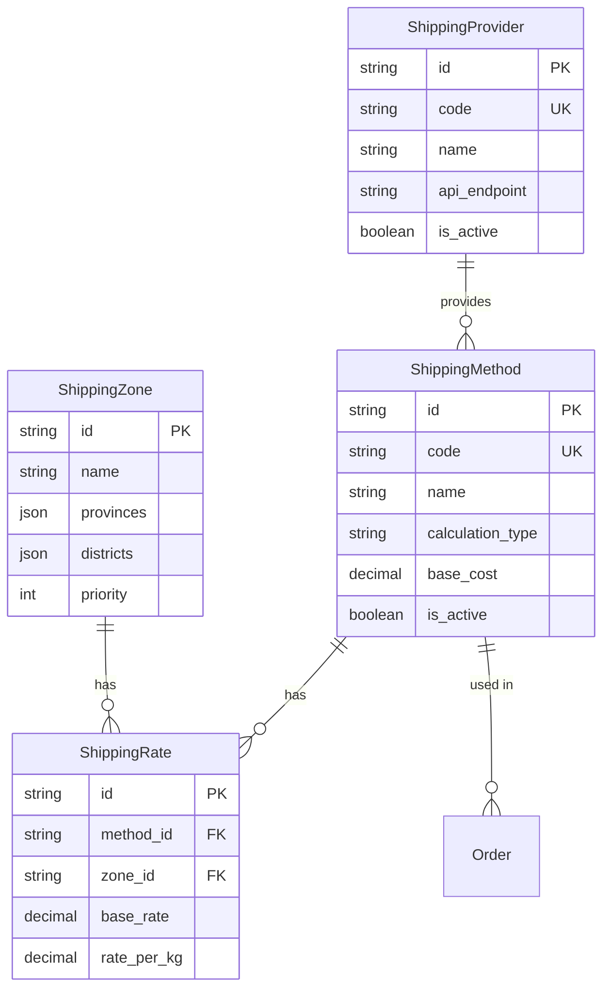
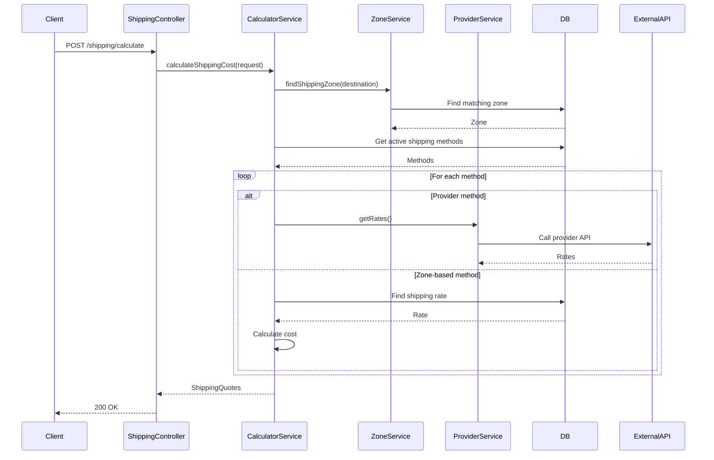
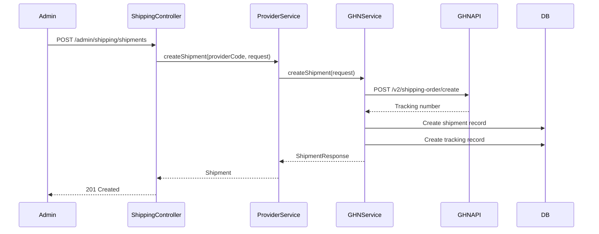

# Technical Design Document: Shipping Management Module (BE.04)

## 1. Overview

Module Shipping Management quản lý toàn bộ hệ thống vận chuyển, bao gồm cấu hình phương thức vận chuyển, tính toán phí ship tự động dựa trên địa chỉ, trọng lượng, và tích hợp với các đơn vị vận chuyển như GHN, GHTK, ViettelPost. Module này đảm bảo khách hàng có thể chọn phương thức vận chuyển phù hợp và theo dõi đơn hàng.

**SRS Reference**: BE.04 - Quản lý Vận chuyển

## 2. Requirements

### 2.1 Functional Requirements

- **BE.04.1**: Cấu hình phương thức vận chuyển và biểu phí (fixed, weight-based, zone-based)
- **BE.04.2**: Tích hợp API với các đơn vị vận chuyển (GHN, GHTK, ViettelPost)
- **BE.04.3**: Tính toán phí vận chuyển tự động dựa trên địa chỉ, trọng lượng, giá trị đơn hàng
- **BE.04.4**: Tạo và quản lý đơn vận chuyển qua API providers
- **BE.04.5**: Theo dõi trạng thái vận chuyển và cập nhật tự động
- **BE.04.6**: Quản lý khu vực giao hàng (zones)

**User Stories:**
- As a customer, I want to see shipping options and costs so that I can choose the best method
- As a customer, I want to track my shipment so that I know when it will arrive
- As an admin, I want to configure shipping methods so that I can offer different delivery options
- As an admin, I want to integrate with shipping providers so that I can automate shipping
- As a system, I want to calculate shipping costs automatically so that customers see accurate prices

### 2.2 Non-Functional Requirements

- **Performance**: 
  - Shipping cost calculation < 500ms
  - Provider API calls timeout < 5 seconds
  - Support concurrent shipping calculations
  - Cache shipping rates for common destinations
- **Security**: 
  - API keys stored securely (encrypted)
  - Rate limiting for provider API calls
  - Input validation for addresses
- **Scalability**: 
  - Support multiple shipping providers
  - Handle high volume of shipping calculations
  - Background processing for tracking updates
- **Consistency**: 
  - Shipping cost consistency during checkout
  - Accurate tracking status updates
  - Reliable provider API integration

## 3. Technical Design

### 3.1. Database Schema Changes (Sequelize)

#### 3.1.1 Shipping Method Entity

```typescript
import { Table, Column, Model, DataType, PrimaryKey, ForeignKey, BelongsTo, Index, AllowNull, Default, Unique } from 'sequelize-typescript';
import { ShippingProvider } from './shipping-provider.entity';

@Table({ tableName: 'tbl_shipping_method', timestamps: false })
export class ShippingMethod extends Model<ShippingMethod> {
  @PrimaryKey
  @Column({ type: DataType.STRING(36) })
  id!: string;

  @Column({ type: DataType.STRING(100), allowNull: false })
  name!: string;

  @Unique
  @Index('idx_code')
  @Column({ type: DataType.STRING(50), allowNull: false })
  code!: string;

  @AllowNull(true)
  @Column({ type: DataType.TEXT })
  description?: string;

  @AllowNull(true)
  @ForeignKey(() => ShippingProvider)
  @Column({ type: DataType.STRING(36) })
  provider_id?: string;

  @Default('standard')
  @Column({ type: DataType.ENUM('standard', 'express', 'same_day', 'economy') })
  method_type!: string;

  @AllowNull(true)
  @Column({ type: DataType.INTEGER })
  delivery_time_min?: number;

  @AllowNull(true)
  @Column({ type: DataType.INTEGER })
  delivery_time_max?: number;

  @Default('fixed')
  @Column({ type: DataType.ENUM('fixed', 'weight_based', 'distance_based', 'zone_based') })
  calculation_type!: string;

  @Default(0)
  @Column({ type: DataType.DECIMAL(10, 2) })
  base_cost!: number;

  @Default(0)
  @Column({ type: DataType.DECIMAL(8, 2) })
  cost_per_kg!: number;

  @Default(0)
  @Column({ type: DataType.DECIMAL(12, 2) })
  free_shipping_threshold!: number;

  @AllowNull(true)
  @Column({ type: DataType.DECIMAL(8, 2) })
  max_weight?: number;

  @Column({ type: DataType.JSON })
  max_dimensions?: { length: number; width: number; height: number };

  @Default(0)
  @Column({ type: DataType.DECIMAL(12, 2) })
  min_order_value!: number;

  @Default(true)
  @Index('idx_is_active')
  @Column({ type: DataType.BOOLEAN })
  is_active!: boolean;

  @Default(false)
  @Column({ type: DataType.BOOLEAN })
  is_default!: boolean;

  @Default(0)
  @Index('idx_display_order')
  @Column({ type: DataType.INTEGER })
  display_order!: number;

  @Default(false)
  @Column({ type: DataType.BOOLEAN })
  cod_supported!: boolean;

  @Default('fixed')
  @Column({ type: DataType.ENUM('fixed', 'percentage') })
  cod_fee_type!: string;

  @Default(0)
  @Column({ type: DataType.DECIMAL(8, 2) })
  cod_fee_value!: number;

  @Column({ type: DataType.DATE, defaultValue: DataType.NOW })
  created_at!: Date;

  @Column({ type: DataType.DATE, defaultValue: DataType.NOW })
  updated_at!: Date;

  @BelongsTo(() => ShippingProvider)
  provider?: ShippingProvider;
}
```

#### 3.1.2 Shipping Zone Entity

```typescript
@Table({ tableName: 'tbl_shipping_zone', timestamps: false })
export class ShippingZone extends Model<ShippingZone> {
  @PrimaryKey
  @Column({ type: DataType.STRING(36) })
  id!: string;

  @Index('idx_name')
  @Column({ type: DataType.STRING(100), allowNull: false })
  name!: string;

  @AllowNull(true)
  @Column({ type: DataType.TEXT })
  description?: string;

  @Default(['VN'])
  @Column({ type: DataType.JSON })
  countries!: string[];

  @Column({ type: DataType.JSON })
  provinces?: string[];

  @Column({ type: DataType.JSON })
  districts?: string[];

  @Column({ type: DataType.JSON })
  wards?: string[];

  @Default(true)
  @Index('idx_is_active')
  @Column({ type: DataType.BOOLEAN })
  is_active!: boolean;

  @Default(0)
  @Index('idx_priority')
  @Column({ type: DataType.INTEGER })
  priority!: number;

  @Column({ type: DataType.DATE, defaultValue: DataType.NOW })
  created_at!: Date;

  @Column({ type: DataType.DATE, defaultValue: DataType.NOW })
  updated_at!: Date;
}
```

#### 3.1.3 Shipping Rate Entity

```typescript
@Table({ tableName: 'tbl_shipping_rate', timestamps: false })
export class ShippingRate extends Model<ShippingRate> {
  @PrimaryKey
  @Column({ type: DataType.STRING(36) })
  id!: string;

  @ForeignKey(() => ShippingMethod)
  @Index('idx_method_zone')
  @Column({ type: DataType.STRING(36), allowNull: false })
  method_id!: string;

  @ForeignKey(() => ShippingZone)
  @Index('idx_method_zone')
  @Column({ type: DataType.STRING(36), allowNull: false })
  zone_id!: string;

  @Default(0)
  @Index('idx_weight_range')
  @Column({ type: DataType.DECIMAL(8, 2) })
  weight_from!: number;

  @AllowNull(true)
  @Column({ type: DataType.DECIMAL(8, 2) })
  weight_to?: number;

  @Default(0)
  @Index('idx_order_value_range')
  @Column({ type: DataType.DECIMAL(12, 2) })
  order_value_from!: number;

  @AllowNull(true)
  @Column({ type: DataType.DECIMAL(12, 2) })
  order_value_to?: number;

  @Column({ type: DataType.DECIMAL(10, 2), allowNull: false })
  base_rate!: number;

  @Default(0)
  @Column({ type: DataType.DECIMAL(8, 2) })
  rate_per_kg!: number;

  @Default(0)
  @Column({ type: DataType.DECIMAL(5, 2) })
  fuel_surcharge_rate!: number;

  @Default(0)
  @Column({ type: DataType.DECIMAL(8, 2) })
  remote_area_fee!: number;

  @Default(0)
  @Column({ type: DataType.DECIMAL(5, 2) })
  insurance_rate!: number;

  @Default(true)
  @Column({ type: DataType.BOOLEAN })
  is_active!: boolean;

  @Column({ type: DataType.DATE, defaultValue: DataType.NOW })
  created_at!: Date;

  @Column({ type: DataType.DATE, defaultValue: DataType.NOW })
  updated_at!: Date;

  @BelongsTo(() => ShippingMethod)
  method?: ShippingMethod;

  @BelongsTo(() => ShippingZone)
  zone?: ShippingZone;
}
```

#### 3.1.4 Shipping Provider Entity

```typescript
@Table({ tableName: 'tbl_shipping_provider', timestamps: false })
export class ShippingProvider extends Model<ShippingProvider> {
  @PrimaryKey
  @Column({ type: DataType.STRING(36) })
  id!: string;

  @Column({ type: DataType.STRING(100), allowNull: false })
  name!: string;

  @Unique
  @Index('idx_code')
  @Column({ type: DataType.STRING(50), allowNull: false })
  code!: string;

  @AllowNull(true)
  @Column({ type: DataType.STRING(500) })
  logo_url?: string;

  @AllowNull(true)
  @Column({ type: DataType.STRING(255) })
  website_url?: string;

  @AllowNull(true)
  @Column({ type: DataType.STRING(255) })
  api_endpoint?: string;

  @AllowNull(true)
  @Column({ type: DataType.STRING(255) })
  api_key?: string; // Encrypted

  @AllowNull(true)
  @Column({ type: DataType.STRING(255) })
  api_secret?: string; // Encrypted

  @Default(true)
  @Column({ type: DataType.BOOLEAN })
  test_mode!: boolean;

  @Default(false)
  @Column({ type: DataType.BOOLEAN })
  supports_tracking!: boolean;

  @Default(false)
  @Column({ type: DataType.BOOLEAN })
  supports_cod!: boolean;

  @Default(false)
  @Column({ type: DataType.BOOLEAN })
  supports_insurance!: boolean;

  @Default(true)
  @Column({ type: DataType.BOOLEAN })
  domestic_service!: boolean;

  @Default(false)
  @Column({ type: DataType.BOOLEAN })
  international_service!: boolean;

  @Default(true)
  @Index('idx_is_active')
  @Column({ type: DataType.BOOLEAN })
  is_active!: boolean;

  @Default(false)
  @Column({ type: DataType.BOOLEAN })
  auto_sync_tracking!: boolean;

  @Default(60)
  @Column({ type: DataType.INTEGER })
  rate_limit_per_minute!: number;

  @AllowNull(true)
  @Column({ type: DataType.DATE })
  last_api_call?: Date;

  @Column({ type: DataType.DATE, defaultValue: DataType.NOW })
  created_at!: Date;

  @Column({ type: DataType.DATE, defaultValue: DataType.NOW })
  updated_at!: Date;
}
```

#### 3.1.5 ERD Diagram



### 3.2. Backend Implementation (NestJS)

#### 3.2.1 Module Structure

```
src/shipping/
├── shipping-method.entity.ts
├── shipping-zone.entity.ts
├── shipping-rate.entity.ts
├── shipping-provider.entity.ts
├── shipping-tracking.entity.ts
├── shipping.controller.ts
├── admin-shipping.controller.ts
├── shipping.service.ts
├── shipping-calculator.service.ts
├── shipping-provider.service.ts
├── ghn.service.ts
├── ghtk.service.ts
├── shipping.module.ts
├── shipping.providers.ts
├── dto/
│   ├── shipping-calculation.dto.ts
│   ├── shipping-method.dto.ts
│   └── tracking.dto.ts
└── interfaces/
    └── shipping-provider.interface.ts
```

#### 3.2.2 API Endpoints

```typescript
@Controller('shipping')
@ApiTags('shipping')
export class ShippingController {
  
  @Post('calculate')
  @ApiOperation({ summary: 'Calculate shipping costs' })
  async calculateShipping(@Body() calculationDto: ShippingCalculationDto): Promise<ShippingQuoteDto[]>

  @Get('methods')
  @ApiOperation({ summary: 'Get available shipping methods for location' })
  async getAvailableShippingMethods(@Query() locationDto: ShippingLocationDto): Promise<AvailableShippingMethodDto[]>

  @Get('tracking/:trackingNumber')
  @ApiOperation({ summary: 'Track shipment (public)' })
  async trackShipment(@Param('trackingNumber') trackingNumber: string): Promise<PublicTrackingInfoDto>
}

@Controller('admin/shipping')
@ApiTags('admin-shipping')
@UseGuards(JwtAuthGuard, RolesGuard)
@Roles('admin')
export class AdminShippingController {
  
  @Get('methods')
  @ApiOperation({ summary: 'Get all shipping methods' })
  async getShippingMethods(): Promise<ShippingMethodDto[]>

  @Post('methods')
  @ApiOperation({ summary: 'Create shipping method' })
  async createShippingMethod(@Body() methodDto: CreateShippingMethodDto): Promise<ShippingMethodDto>

  @Get('zones')
  @ApiOperation({ summary: 'Get all shipping zones' })
  async getShippingZones(): Promise<ShippingZoneDto[]>

  @Post('zones')
  @ApiOperation({ summary: 'Create shipping zone' })
  async createShippingZone(@Body() zoneDto: CreateShippingZoneDto): Promise<ShippingZoneDto>

  @Post('providers')
  @ApiOperation({ summary: 'Configure shipping provider' })
  async configureShippingProvider(@Body() providerDto: ConfigureShippingProviderDto): Promise<ShippingProviderDto>

  @Post('providers/:id/test')
  @ApiOperation({ summary: 'Test provider API connection' })
  async testProviderConnection(@Param('id') id: string): Promise<ProviderTestResultDto>
}
```

#### 3.2.3 Service Logic

```typescript
@Injectable()
export class ShippingCalculatorService {
  async calculateShippingCost(request: ShippingCalculationRequest): Promise<ShippingQuote[]> {
    const { items, destination, orderValue, weight, dimensions } = request;

    // Find applicable shipping zone
    const zone = await this.findShippingZone(destination);
    if (!zone) {
      throw new ShippingZoneNotFoundException(destination);
    }

    // Get available shipping methods for zone
    const methods = await ShippingMethod.findAll({
      where: {
        is_active: true,
        [Op.or]: [
          { provider_id: null }, // Manual methods
          { provider_id: { [Op.ne]: null } } // Provider methods
        ]
      },
      include: [
        { model: ShippingProvider, where: { is_active: true }, required: false }
      ],
      order: [['display_order', 'ASC']]
    });

    const quotes: ShippingQuote[] = [];

    for (const method of methods) {
      try {
        let cost: number;

        if (method.provider_id && method.provider) {
          // Calculate via provider API
          cost = await this.calculateViaProvider(method, request);
        } else {
          // Calculate via zone-based rates
          cost = await this.calculateViaZone(method, zone, weight, orderValue);
        }

        // Apply free shipping threshold
        if (method.free_shipping_threshold > 0 && orderValue >= method.free_shipping_threshold) {
          cost = 0;
        }

        // Check restrictions
        if (method.max_weight && weight > method.max_weight) {
          continue; // Skip this method
        }

        if (method.min_order_value > 0 && orderValue < method.min_order_value) {
          continue; // Skip this method
        }

        quotes.push({
          methodId: method.id,
          methodName: method.name,
          methodCode: method.code,
          cost,
          estimatedDays: {
            min: method.delivery_time_min || 2,
            max: method.delivery_time_max || 5
          },
          provider: method.provider?.name
        });
      } catch (error) {
        // Log error but continue with other methods
        this.logger.warn(`Failed to calculate shipping for method ${method.code}`, error);
      }
    }

    return quotes.sort((a, b) => a.cost - b.cost);
  }

  private async calculateViaZone(
    method: ShippingMethod,
    zone: ShippingZone,
    weight: number,
    orderValue: number
  ): Promise<number> {
    // Find applicable rate
    const rate = await ShippingRate.findOne({
      where: {
        method_id: method.id,
        zone_id: zone.id,
        is_active: true,
        weight_from: { [Op.lte]: weight },
        [Op.or]: [
          { weight_to: null },
          { weight_to: { [Op.gte]: weight } }
        ],
        order_value_from: { [Op.lte]: orderValue },
        [Op.or]: [
          { order_value_to: null },
          { order_value_to: { [Op.gte]: orderValue } }
        ]
      },
      order: [['weight_from', 'DESC']]
    });

    if (!rate) {
      throw new ShippingRateNotFoundException(method.id, zone.id);
    }

    // Calculate cost
    let cost = parseFloat(rate.base_rate.toString());
    
    // Add weight-based cost
    if (rate.rate_per_kg > 0) {
      cost += parseFloat(rate.rate_per_kg.toString()) * weight;
    }

    // Add fuel surcharge
    if (rate.fuel_surcharge_rate > 0) {
      cost += cost * (parseFloat(rate.fuel_surcharge_rate.toString()) / 100);
    }

    // Add insurance
    if (rate.insurance_rate > 0) {
      cost += orderValue * (parseFloat(rate.insurance_rate.toString()) / 100);
    }

    // Add remote area fee if applicable
    // This would require checking if destination is remote area
    // cost += rate.remote_area_fee;

    return Math.round(cost);
  }

  private async calculateViaProvider(
    method: ShippingMethod,
    request: ShippingCalculationRequest
  ): Promise<number> {
    if (!method.provider) {
      throw new ProviderNotConfiguredException(method.provider_id);
    }

    const providerService = this.getProviderService(method.provider.code);
    const providerRates = await providerService.getRates({
      fromAddress: request.fromAddress,
      toAddress: request.destination,
      weight: request.weight,
      dimensions: request.dimensions,
      orderValue: request.orderValue
    });

    // Return the first rate (or best rate)
    return providerRates[0]?.cost || 0;
  }

  private async findShippingZone(address: AddressDto): Promise<ShippingZone | null> {
    const zones = await ShippingZone.findAll({
      where: { is_active: true },
      order: [['priority', 'DESC']]
    });

    for (const zone of zones) {
      if (this.isAddressInZone(address, zone)) {
        return zone;
      }
    }

    return null;
  }

  private isAddressInZone(address: AddressDto, zone: ShippingZone): boolean {
    // Check country
    if (zone.countries && !zone.countries.includes(address.country)) {
      return false;
    }

    // Check province
    if (zone.provinces && zone.provinces.length > 0) {
      if (!zone.provinces.includes(address.province)) {
        return false;
      }
    }

    // Check district (if specified)
    if (zone.districts && zone.districts.length > 0) {
      if (!zone.districts.includes(address.district)) {
        return false;
      }
    }

    // Check ward (if specified)
    if (zone.wards && zone.wards.length > 0) {
      if (!zone.wards.includes(address.ward)) {
        return false;
      }
    }

    return true;
  }
}

@Injectable()
export class ShippingProviderService {
  private providers = new Map<string, IShippingProviderAdapter>();

  constructor(
    private ghnService: GHNService,
    private ghtkService: GHTKService,
    private viettelPostService: ViettelPostService
  ) {
    this.providers.set('ghn', this.ghnService);
    this.providers.set('ghtk', this.ghtkService);
    this.providers.set('viettelpost', this.viettelPostService);
  }

  getProviderService(code: string): IShippingProviderAdapter {
    const provider = this.providers.get(code.toLowerCase());
    if (!provider) {
      throw new UnsupportedProviderException(code);
    }
    return provider;
  }

  async createShipment(
    providerCode: string,
    request: CreateShipmentRequest
  ): Promise<CreateShipmentResponse> {
    const provider = this.getProviderService(providerCode);
    return provider.createShipment(request);
  }

  async trackShipment(
    providerCode: string,
    trackingNumber: string
  ): Promise<TrackingInfo> {
    const provider = this.getProviderService(providerCode);
    return provider.trackShipment(trackingNumber);
  }
}

@Injectable()
export class GHNService implements IShippingProviderAdapter {
  private readonly API_BASE_URL = 'https://dev-online-gateway.ghn.vn/shiip/public-api';

  constructor(
    private httpService: HttpService,
    private configService: ConfigService
  ) {}

  async getRates(request: ShippingRateRequest): Promise<ProviderShippingRate[]> {
    const url = `${this.API_BASE_URL}/v2/shipping-order/fee`;

    const payload = {
      service_type_id: 2, // Standard service
      to_district_id: request.toAddress.districtId,
      to_ward_code: request.toAddress.wardCode,
      height: request.dimensions?.height || 10,
      length: request.dimensions?.length || 20,
      weight: Math.ceil(request.weight * 1000), // Convert to grams
      width: request.dimensions?.width || 15,
      insurance_value: request.insuranceValue || 0,
      cod_failed_amount: request.codAmount || 0
    };

    try {
      const response = await this.httpService.post(url, payload, {
        headers: {
          'Token': this.configService.get('GHN_API_TOKEN'),
          'ShopId': this.configService.get('GHN_SHOP_ID'),
          'Content-Type': 'application/json'
        }
      }).toPromise();

      if (response.data.code === 200) {
        return [{
          serviceType: 'standard',
          serviceName: 'Giao hàng tiêu chuẩn',
          cost: response.data.data.total,
          estimatedDays: { min: 2, max: 4 }
        }];
      } else {
        throw new Error(response.data.message || 'Unknown GHN API error');
      }
    } catch (error) {
      this.logger.error('GHN rate calculation failed', error);
      throw new ProviderApiException('GHN', 'Rate calculation failed', error);
    }
  }

  async createShipment(request: CreateProviderShipmentRequest): Promise<CreateShipmentResponse> {
    const url = `${this.API_BASE_URL}/v2/shipping-order/create`;

    const payload = {
      to_name: request.toAddress.fullName,
      to_phone: request.toAddress.phoneNumber,
      to_address: request.toAddress.streetAddress,
      to_ward_code: request.toAddress.wardCode,
      to_district_id: request.toAddress.districtId,
      cod_amount: request.codAmount || 0,
      content: request.items.map(item => item.name).join(', '),
      weight: Math.ceil(request.totalWeight * 1000),
      length: request.dimensions?.length || 20,
      width: request.dimensions?.width || 15,
      height: request.dimensions?.height || 10,
      service_type_id: 2,
      payment_type_id: request.codAmount > 0 ? 2 : 1
    };

    try {
      const response = await this.httpService.post(url, payload, {
        headers: {
          'Token': this.configService.get('GHN_API_TOKEN'),
          'ShopId': this.configService.get('GHN_SHOP_ID'),
          'Content-Type': 'application/json'
        }
      }).toPromise();

      if (response.data.code === 200) {
        return {
          trackingNumber: response.data.data.order_code,
          shipmentId: response.data.data.order_code,
          estimatedDelivery: this.calculateEstimatedDelivery(2, 4),
          cost: response.data.data.total_fee
        };
      } else {
        throw new Error(response.data.message || 'Unknown GHN API error');
      }
    } catch (error) {
      this.logger.error('GHN shipment creation failed', error);
      throw new ProviderApiException('GHN', 'Shipment creation failed', error);
    }
  }

  async trackShipment(trackingNumber: string): Promise<TrackingInfo> {
    const url = `${this.API_BASE_URL}/v2/shipping-order/detail`;

    const payload = { order_code: trackingNumber };

    try {
      const response = await this.httpService.post(url, payload, {
        headers: {
          'Token': this.configService.get('GHN_API_TOKEN'),
          'ShopId': this.configService.get('GHN_SHOP_ID'),
          'Content-Type': 'application/json'
        }
      }).toPromise();

      if (response.data.code === 200) {
        const data = response.data.data;
        return {
          trackingNumber,
          status: this.mapGHNStatus(data.status),
          currentLocation: data.current_address || '',
          estimatedDelivery: data.expected_delivery_time,
          actualDelivery: data.deliver_date,
          events: this.mapGHNEvents(data.log || [])
        };
      } else {
        throw new Error(response.data.message || 'Unknown GHN API error');
      }
    } catch (error) {
      this.logger.error(`GHN tracking failed for ${trackingNumber}`, error);
      throw new ProviderApiException('GHN', 'Tracking failed', error);
    }
  }

  private mapGHNStatus(ghnStatus: string): ShippingStatus {
    const statusMap: Record<string, ShippingStatus> = {
      'ready_to_pick': 'pending',
      'picking': 'picked_up',
      'storing': 'in_transit',
      'transporting': 'in_transit',
      'sorting': 'in_transit',
      'delivering': 'out_for_delivery',
      'delivered': 'delivered',
      'return': 'returned',
      'cancel': 'cancelled'
    };
    return statusMap[ghnStatus] || 'pending';
  }

  private mapGHNEvents(ghnLogs: any[]): TrackingEvent[] {
    return ghnLogs.map(log => ({
      status: this.mapGHNStatus(log.status),
      location: log.location || '',
      timestamp: new Date(log.time),
      description: log.status_name || ''
    }));
  }

  private calculateEstimatedDelivery(minDays: number, maxDays: number): Date {
    const now = new Date();
    now.setDate(now.getDate() + maxDays);
    return now;
  }
}
```

#### 3.2.4 Data Access Patterns

- Use `include` for eager loading (provider, zone, rates)
- Use `attributes` to limit fields in listings
- Implement proper indexing for zone matching
- Cache shipping rates for common destinations (TTL: 1 hour)
- Use background jobs for tracking updates

### 3.3. Logic Flow

#### 3.3.1 Calculate Shipping Cost Flow



#### 3.3.2 Create Shipment via Provider Flow



### 3.4. Security & Performance

#### 3.4.1 Authentication/Authorization

- **JwtAuthGuard**: Required for admin endpoints
- **RolesGuard**: Admin only for configuration
- **Public endpoints**: Shipping calculation and tracking (no auth required)

#### 3.4.2 Validation

- DTO validation using `class-validator`
- Address validation (province, district, ward)
- Weight and dimension validation
- Provider API response validation

#### 3.4.3 Caching Strategy

- Cache shipping rates by destination (TTL: 1 hour)
- Cache zone lookups (TTL: 24 hours)
- Cache provider API responses (TTL: 15 minutes)
- Invalidate cache on configuration changes

#### 3.4.4 Database Optimization

- Indexes on: `code`, `is_active`, `display_order`, `method_id`, `zone_id`
- Composite indexes for rate lookups
- Use read replicas for shipping calculations (if available)

## 4. Testing Plan

### 4.1 Unit Tests

- Shipping calculator logic
- Zone matching algorithms
- Rate calculation formulas
- Provider adapter implementations
- Address validation

### 4.2 Integration Tests

- Shipping calculation API
- Provider API integration (mocked)
- Zone configuration
- Rate management
- Tracking updates

### 4.3 E2E Tests

- Complete shipping calculation flow
- Provider shipment creation
- Tracking information retrieval
- Admin configuration workflow

## 5. Alternatives Considered

### 5.1 Shipping Cost Calculation

**Option A: Zone-based with provider fallback (current)**
- Pros: Flexible, supports both manual and provider rates, good for MVP
- Cons: More complex logic
- **Chosen**: Best balance of flexibility and simplicity

**Option B: Provider-only**
- Pros: Always accurate, no manual configuration
- Cons: Depends on provider availability, API costs
- **Rejected**: Too dependent on external services

**Option C: Manual-only (fixed rates)**
- Pros: Simple, predictable
- Cons: Not accurate, doesn't scale
- **Rejected**: Poor user experience

### 5.2 Provider Integration Strategy

**Option A: Adapter pattern (current)**
- Pros: Easy to add new providers, consistent interface
- Cons: Need to implement each adapter
- **Chosen**: Best for extensibility

**Option B: Single provider**
- Pros: Simpler, less code
- Cons: Vendor lock-in, less flexibility
- **Rejected**: Too limiting

**Option C: Third-party shipping aggregator**
- Pros: Single integration, handles multiple providers
- Cons: Additional cost, less control
- **Considered**: May use in future if needed

### 5.3 Zone Matching Strategy

**Option A: Priority-based matching (current)**
- Pros: Flexible, supports overlapping zones
- Cons: Need to manage priorities
- **Chosen**: Most flexible approach

**Option B: First match**
- Pros: Simple
- Cons: May match wrong zone
- **Rejected**: Less accurate

**Option C: Most specific match**
- Pros: Most accurate
- Cons: Complex logic
- **Considered**: May implement if needed

## 6. Implementation Checklist

- [ ] Create ShippingMethod entity with Sequelize decorators
- [ ] Create ShippingZone entity
- [ ] Create ShippingRate entity
- [ ] Create ShippingProvider entity
- [ ] Create ShippingTracking entity
- [ ] Create migration files for all tables
- [ ] Implement ShippingCalculatorService
- [ ] Implement ShippingProviderService with adapter pattern
- [ ] Implement GHNService adapter
- [ ] Implement GHTKService adapter (optional)
- [ ] Implement ViettelPostService adapter (optional)
- [ ] Create DTOs with validation
- [ ] Implement ShippingController (public endpoints)
- [ ] Implement AdminShippingController
- [ ] Add zone matching logic
- [ ] Add rate calculation logic
- [ ] Add provider API integration
- [ ] Add tracking sync (scheduled job)
- [ ] Add Redis caching
- [ ] Write unit tests
- [ ] Write integration tests
- [ ] Write E2E tests
