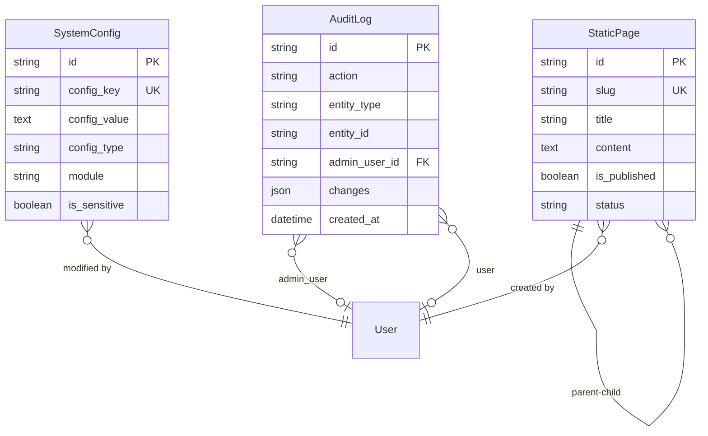
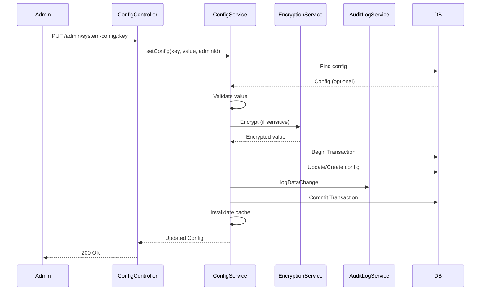
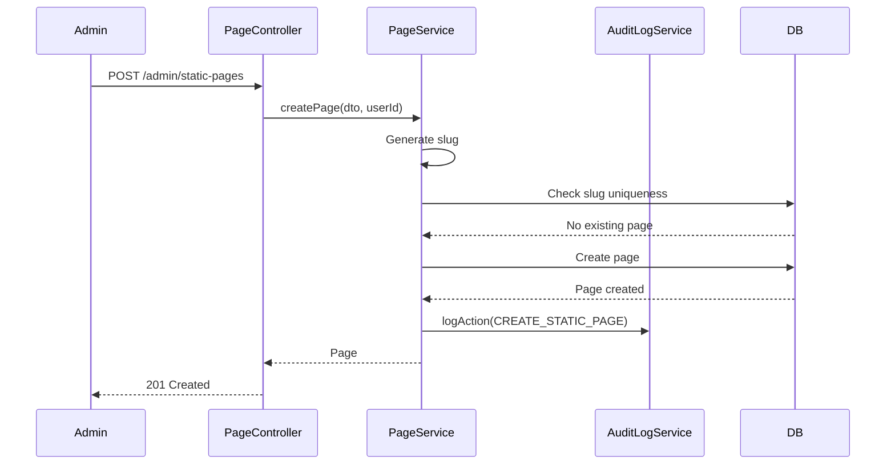

# Technical Design Document: System Administration Module (BE.06)

## 1. Overview

Module System Administration cung cấp đầy đủ công cụ quản trị hệ thống, bao gồm quản lý người dùng nội bộ (Admin/Staff), phân quyền chi tiết (Role-Based Access Control), cấu hình hệ thống toàn cục, quản lý nội dung trang tĩnh, và audit logging. Module này là nền tảng cho việc quản lý và bảo mật hệ thống.

**SRS Reference**: BE.06 - Quản trị Hệ thống

**Note**: Role và Permission entities đã được implement trong project (xem migrations). Module này tập trung vào System Config, Static Pages, và Audit Logs.

## 2. Requirements

### 2.1 Functional Requirements

- **BE.06.1**: Quản lý tài khoản Admin/Nhân viên và phân quyền (sử dụng Role/Permission đã có)
- **BE.06.2**: Cấu hình hệ thống toàn cục (email, payment, general settings)
- **BE.06.3**: Quản lý nội dung trang tĩnh (About, Terms, Privacy Policy, etc.)
- **BE.06.4**: Audit logging cho tất cả các thao tác quan trọng
- **BE.06.5**: Giám sát hoạt động hệ thống (system status, health checks)
- **BE.06.6**: Quản lý backup và khôi phục cấu hình

**User Stories:**
- As an admin, I want to configure system settings so that I can customize the platform
- As an admin, I want to manage static pages so that I can update content without code changes
- As an admin, I want to view audit logs so that I can track system activities
- As an admin, I want to assign roles to users so that I can control access
- As a system, I want to log all important actions so that I can audit and debug

### 2.2 Non-Functional Requirements

- **Performance**: 
  - Config retrieval < 100ms (cached)
  - Audit log queries < 500ms with pagination
  - Static page retrieval < 200ms
- **Security**: 
  - Sensitive configs encrypted
  - Audit logs immutable (append-only)
  - Role-based access control enforced
  - Secure password storage
- **Scalability**: 
  - Support large audit log volumes
  - Efficient config caching
  - Archive old audit logs
- **Consistency**: 
  - Config changes atomic
  - Audit logs never lost
  - Role/permission consistency

## 3. Technical Design

### 3.1. Database Schema Changes (Sequelize)

#### 3.1.1 System Configuration Entity

```typescript
import { Table, Column, Model, DataType, PrimaryKey, ForeignKey, BelongsTo, Index, AllowNull, Default, Unique } from 'sequelize-typescript';
import { User } from 'src/user/user.entity';

@Table({ tableName: 'tbl_system_config', timestamps: false })
export class SystemConfig extends Model<SystemConfig> {
  @PrimaryKey
  @Column({ type: DataType.STRING(36) })
  id!: string;

  @Unique
  @Index('idx_config_key')
  @Column({ type: DataType.STRING(255), allowNull: false })
  config_key!: string;

  @Column({ type: DataType.TEXT })
  config_value?: string;

  @Default('string')
  @Column({ type: DataType.ENUM('string', 'number', 'boolean', 'json', 'encrypted') })
  config_type!: string;

  @Index('idx_module')
  @Column({ type: DataType.STRING(100) })
  module?: string;

  @Index('idx_category')
  @Column({ type: DataType.STRING(100) })
  category?: string;

  @Column({ type: DataType.JSON })
  validation_rules?: Record<string, any>;

  @Column({ type: DataType.TEXT })
  default_value?: string;

  @Default(false)
  @Column({ type: DataType.BOOLEAN })
  is_sensitive!: boolean;

  @Default(false)
  @Index('idx_is_public')
  @Column({ type: DataType.BOOLEAN })
  is_public!: boolean;

  @Default(false)
  @Column({ type: DataType.BOOLEAN })
  requires_restart!: boolean;

  @AllowNull(true)
  @Column({ type: DataType.TEXT })
  description?: string;

  @AllowNull(true)
  @Column({ type: DataType.STRING(255) })
  display_name?: string;

  @Default(0)
  @Column({ type: DataType.INTEGER })
  display_order!: number;

  @AllowNull(true)
  @ForeignKey(() => User)
  @Column({ type: DataType.STRING(36) })
  last_modified_by?: string;

  @Column({ type: DataType.DATE, defaultValue: DataType.NOW })
  created_at!: Date;

  @Column({ type: DataType.DATE, defaultValue: DataType.NOW })
  updated_at!: Date;

  @BelongsTo(() => User)
  lastModifier?: User;
}
```

#### 3.1.2 Static Page Entity

```typescript
@Table({ tableName: 'tbl_static_page', timestamps: false })
export class StaticPage extends Model<StaticPage> {
  @PrimaryKey
  @Column({ type: DataType.STRING(36) })
  id!: string;

  @Column({ type: DataType.STRING(255), allowNull: false })
  title!: string;

  @Unique
  @Index('idx_slug')
  @Column({ type: DataType.STRING(255), allowNull: false })
  slug!: string;

  @Column({ type: DataType.TEXT('long') })
  content?: string;

  @AllowNull(true)
  @Column({ type: DataType.STRING(255) })
  meta_title?: string;

  @AllowNull(true)
  @Column({ type: DataType.TEXT })
  meta_description?: string;

  @AllowNull(true)
  @Column({ type: DataType.TEXT })
  meta_keywords?: string;

  @Default(false)
  @Index('idx_is_published')
  @Column({ type: DataType.BOOLEAN })
  is_published!: boolean;

  @Default(true)
  @Column({ type: DataType.BOOLEAN })
  is_indexable!: boolean;

  @Default('default')
  @Column({ type: DataType.STRING(100) })
  template!: string;

  @Default(false)
  @Index('idx_show_in_menu')
  @Column({ type: DataType.BOOLEAN })
  show_in_menu!: boolean;

  @Default(0)
  @Column({ type: DataType.INTEGER })
  menu_order!: number;

  @AllowNull(true)
  @ForeignKey(() => StaticPage)
  @Column({ type: DataType.STRING(36) })
  parent_page_id?: string;

  @Default('vi')
  @Index('idx_language')
  @Column({ type: DataType.STRING(5) })
  language!: string;

  @Default('draft')
  @Index('idx_status')
  @Column({ type: DataType.ENUM('draft', 'published', 'archived') })
  status!: string;

  @ForeignKey(() => User)
  @Column({ type: DataType.STRING(36), allowNull: false })
  created_by!: string;

  @AllowNull(true)
  @ForeignKey(() => User)
  @Column({ type: DataType.STRING(36) })
  last_modified_by?: string;

  @AllowNull(true)
  @Column({ type: DataType.DATE })
  published_at?: Date;

  @Column({ type: DataType.DATE, defaultValue: DataType.NOW })
  created_at!: Date;

  @Column({ type: DataType.DATE, defaultValue: DataType.NOW })
  updated_at!: Date;

  @BelongsTo(() => StaticPage, { foreignKey: 'parent_page_id', as: 'parent' })
  parent?: StaticPage;

  @HasMany(() => StaticPage, { foreignKey: 'parent_page_id', as: 'children' })
  children?: StaticPage[];

  @BelongsTo(() => User, { foreignKey: 'created_by', as: 'creator' })
  creator?: User;

  @BelongsTo(() => User, { foreignKey: 'last_modified_by', as: 'lastModifier' })
  lastModifier?: User;
}
```

#### 3.1.3 Audit Log Entity

```typescript
@Table({ tableName: 'tbl_audit_log', timestamps: false })
export class AuditLog extends Model<AuditLog> {
  @PrimaryKey
  @Column({ type: DataType.STRING(36) })
  id!: string;

  @Index('idx_action')
  @Column({ type: DataType.STRING(100), allowNull: false })
  action!: string;

  @Index('idx_entity_type')
  @Column({ type: DataType.STRING(100) })
  entity_type?: string;

  @Index('idx_entity_id')
  @Column({ type: DataType.STRING(36) })
  entity_id?: string;

  @AllowNull(true)
  @ForeignKey(() => User)
  @Index('idx_admin_user_id')
  @Column({ type: DataType.STRING(36) })
  admin_user_id?: string;

  @AllowNull(true)
  @ForeignKey(() => User)
  @Index('idx_user_id')
  @Column({ type: DataType.STRING(36) })
  user_id?: string;

  @AllowNull(true)
  @Column({ type: DataType.STRING(255) })
  username?: string;

  @Default('admin')
  @Column({ type: DataType.ENUM('admin', 'customer', 'system') })
  user_type!: string;

  @Index('idx_ip_address')
  @Column({ type: DataType.STRING(45) })
  ip_address?: string;

  @Column({ type: DataType.TEXT })
  user_agent?: string;

  @Column({ type: DataType.STRING(10) })
  request_method?: string;

  @Column({ type: DataType.STRING(500) })
  request_url?: string;

  @Column({ type: DataType.JSON })
  old_values?: Record<string, any>;

  @Column({ type: DataType.JSON })
  new_values?: Record<string, any>;

  @Column({ type: DataType.JSON })
  changes?: Record<string, any>;

  @Index('idx_module')
  @Column({ type: DataType.STRING(100) })
  module?: string;

  @Column({ type: DataType.TEXT })
  description?: string;

  @Default('medium')
  @Index('idx_severity')
  @Column({ type: DataType.ENUM('low', 'medium', 'high', 'critical') })
  severity!: string;

  @Column({ type: DataType.STRING(255) })
  session_id?: string;

  @Column({ type: DataType.STRING(255) })
  request_id?: string;

  @Column({ type: DataType.JSON })
  metadata?: Record<string, any>;

  @Index('idx_created_at')
  @Column({ type: DataType.DATE, defaultValue: DataType.NOW })
  created_at!: Date;

  @BelongsTo(() => User, { foreignKey: 'admin_user_id', as: 'adminUser' })
  adminUser?: User;

  @BelongsTo(() => User, { foreignKey: 'user_id', as: 'user' })
  user?: User;
}
```

#### 3.1.4 ERD Diagram



### 3.2. Backend Implementation (NestJS)

#### 3.2.1 Module Structure

```
src/admin/
├── system-config.entity.ts
├── static-page.entity.ts
├── audit-log.entity.ts
├── system-config.controller.ts
├── static-page.controller.ts
├── audit-log.controller.ts
├── system-config.service.ts
├── static-page.service.ts
├── audit-log.service.ts
├── admin.module.ts
├── admin.providers.ts
├── dto/
│   ├── system-config.dto.ts
│   ├── static-page.dto.ts
│   └── audit-log.dto.ts
├── decorators/
│   └── audit-log.decorator.ts
└── guards/
    └── permission.guard.ts
```

#### 3.2.2 API Endpoints

```typescript
@Controller('admin/system-config')
@ApiTags('admin-system-config')
@UseGuards(JwtAuthGuard, RolesGuard)
@Roles('admin')
export class SystemConfigController {
  
  @Get()
  @ApiOperation({ summary: 'Get all system configurations' })
  async getConfigs(@Query() queryDto: ConfigQueryDto): Promise<SystemConfigDto[]>

  @Get('public')
  @ApiOperation({ summary: 'Get public configurations' })
  async getPublicConfigs(): Promise<PublicConfigDto[]>

  @Get(':key')
  @ApiOperation({ summary: 'Get configuration by key' })
  async getConfig(@Param('key') key: string): Promise<SystemConfigDto>

  @Put(':key')
  @ApiOperation({ summary: 'Update configuration' })
  @AuditLog('UPDATE_SYSTEM_CONFIG')
  async updateConfig(@Param('key') key: string, @Body() updateDto: UpdateConfigDto, @Req() req: Request): Promise<SystemConfigDto>

  @Post('bulk-update')
  @ApiOperation({ summary: 'Bulk update configurations' })
  @AuditLog('BULK_UPDATE_CONFIG')
  async bulkUpdateConfigs(@Body() bulkDto: BulkUpdateConfigDto, @Req() req: Request): Promise<BulkUpdateResultDto>
}

@Controller('admin/static-pages')
@ApiTags('admin-static-pages')
@UseGuards(JwtAuthGuard, RolesGuard)
@Roles('admin', 'staff')
export class StaticPageController {
  
  @Get()
  @ApiOperation({ summary: 'Get all static pages' })
  async getPages(@Query() queryDto: PageQueryDto): Promise<IPaginatedResult<StaticPageDto>>

  @Get('public/:slug')
  @ApiOperation({ summary: 'Get published static page by slug (public)' })
  async getPublicPage(@Param('slug') slug: string): Promise<StaticPageDto>

  @Post()
  @ApiOperation({ summary: 'Create static page' })
  @AuditLog('CREATE_STATIC_PAGE')
  async createPage(@Body() createDto: CreateStaticPageDto, @Req() req: Request): Promise<StaticPageDto>

  @Put(':id')
  @ApiOperation({ summary: 'Update static page' })
  @AuditLog('UPDATE_STATIC_PAGE')
  async updatePage(@Param('id') id: string, @Body() updateDto: UpdateStaticPageDto, @Req() req: Request): Promise<StaticPageDto>

  @Put(':id/publish')
  @ApiOperation({ summary: 'Publish/unpublish static page' })
  @AuditLog('PUBLISH_STATIC_PAGE')
  async togglePublication(@Param('id') id: string, @Body() publishDto: PublishPageDto, @Req() req: Request): Promise<StaticPageDto>
}

@Controller('admin/audit')
@ApiTags('admin-audit')
@UseGuards(JwtAuthGuard, RolesGuard)
@Roles('admin')
export class AuditLogController {
  
  @Get('logs')
  @ApiOperation({ summary: 'Get audit logs' })
  async getAuditLogs(@Query() queryDto: AuditLogQueryDto): Promise<IPaginatedResult<AuditLogDto>>

  @Get('logs/:id')
  @ApiOperation({ summary: 'Get audit log details' })
  async getAuditLog(@Param('id') id: string): Promise<AuditLogDetailDto>

  @Get('activity/:userId')
  @ApiOperation({ summary: 'Get user activity logs' })
  async getUserActivity(@Param('userId') userId: string, @Query() queryDto: ActivityQueryDto): Promise<UserActivityDto>

  @Get('export')
  @ApiOperation({ summary: 'Export audit logs' })
  async exportAuditLogs(@Query() exportDto: AuditExportDto, @Res() response: Response): Promise<void>
}
```

#### 3.2.3 Service Logic

```typescript
@Injectable()
export class SystemConfigService {
  private configCache = new Map<string, any>();

  async getConfig(key: string): Promise<any> {
    // Check cache first
    if (this.configCache.has(key)) {
      return this.configCache.get(key);
    }

    const config = await SystemConfig.findOne({ where: { config_key: key } });
    if (!config) {
      return null;
    }

    let value = config.config_value;

    // Parse based on type
    switch (config.config_type) {
      case 'number':
        value = parseFloat(value || '0');
        break;
      case 'boolean':
        value = value === 'true';
        break;
      case 'json':
        value = JSON.parse(value || '{}');
        break;
      case 'encrypted':
        value = this.decryptValue(value);
        break;
    }

    // Cache the value
    this.configCache.set(key, value);
    return value;
  }

  async setConfig(key: string, value: any, adminId: string): Promise<SystemConfig> {
    const config = await SystemConfig.findOne({ where: { config_key: key } });

    let stringValue: string;
    const configType = config?.config_type || this.inferType(value);

    // Convert to string based on type
    switch (configType) {
      case 'number':
      case 'boolean':
        stringValue = String(value);
        break;
      case 'json':
        stringValue = JSON.stringify(value);
        break;
      case 'encrypted':
        stringValue = this.encryptValue(value);
        break;
      default:
        stringValue = String(value);
    }

    const t = await this.transaction();
    try {
      let updatedConfig: SystemConfig;

      if (config) {
        // Validate if validation rules exist
        if (config.validation_rules) {
          this.validateValue(value, config.validation_rules);
        }

        await config.update({
          config_value: stringValue,
          last_modified_by: adminId
        }, { transaction: t });

        updatedConfig = config;
      } else {
        updatedConfig = await SystemConfig.create({
          id: uuidv4(),
          config_key: key,
          config_value: stringValue,
          config_type: configType,
          last_modified_by: adminId
        }, { transaction: t });
      }

      await t.commit();

      // Invalidate cache
      this.configCache.delete(key);

      // Log audit
      await this.auditLogService.logDataChange(
        'SystemConfig',
        updatedConfig.id,
        config ? { [key]: config.config_value } : null,
        { [key]: stringValue },
        adminId
      );

      return updatedConfig;
    } catch (error) {
      await t.rollback();
      throw error;
    }
  }

  async getPublicConfigs(): Promise<SystemConfig[]> {
    const configs = await SystemConfig.findAll({
      where: { is_public: true },
      attributes: ['config_key', 'config_value', 'config_type', 'display_name'],
      order: [['display_order', 'ASC']]
    });

    return configs.map(config => ({
      ...config.toJSON(),
      value: this.parseConfigValue(config.config_value, config.config_type)
    }));
  }

  private inferType(value: any): string {
    if (typeof value === 'number') return 'number';
    if (typeof value === 'boolean') return 'boolean';
    if (typeof value === 'object') return 'json';
    return 'string';
  }

  private parseConfigValue(value: string, type: string): any {
    switch (type) {
      case 'number':
        return parseFloat(value || '0');
      case 'boolean':
        return value === 'true';
      case 'json':
        return JSON.parse(value || '{}');
      default:
        return value;
    }
  }

  private encryptValue(value: string): string {
    // Use encryption service
    return this.encryptionService.encrypt(value);
  }

  private decryptValue(encryptedValue: string): string {
    return this.encryptionService.decrypt(encryptedValue);
  }

  private validateValue(value: any, rules: Record<string, any>): void {
    if (rules.min !== undefined && value < rules.min) {
      throw new BadRequestException(`Value must be at least ${rules.min}`);
    }
    if (rules.max !== undefined && value > rules.max) {
      throw new BadRequestException(`Value must be at most ${rules.max}`);
    }
    if (rules.pattern && !new RegExp(rules.pattern).test(value)) {
      throw new BadRequestException(`Value does not match required pattern`);
    }
  }
}

@Injectable()
export class StaticPageService extends CrudService<StaticPage> {
  constructor() {
    super(StaticPage);
  }

  async createPage(createDto: CreateStaticPageDto, userId: string): Promise<StaticPage> {
    // Generate slug if not provided
    const slug = createDto.slug || this.generateSlug(createDto.title);

    // Check if slug exists
    const existing = await StaticPage.findOne({ where: { slug } });
    if (existing) {
      throw new ConflictException(`Page with slug "${slug}" already exists`);
    }

    const page = await StaticPage.create({
      id: uuidv4(),
      title: createDto.title,
      slug,
      content: createDto.content,
      meta_title: createDto.metaTitle,
      meta_description: createDto.metaDescription,
      meta_keywords: createDto.metaKeywords,
      template: createDto.template || 'default',
      show_in_menu: createDto.showInMenu || false,
      menu_order: createDto.menuOrder || 0,
      parent_page_id: createDto.parentPageId,
      language: createDto.language || 'vi',
      status: 'draft',
      created_by: userId
    });

    return page;
  }

  async updatePage(id: string, updateDto: UpdateStaticPageDto, userId: string): Promise<StaticPage> {
    const page = await StaticPage.findByPk(id);
    if (!page) {
      throw new NotFoundException(`Page with ID ${id} not found`);
    }

    const updateData: any = {
      last_modified_by: userId
    };

    if (updateDto.title) updateData.title = updateDto.title;
    if (updateDto.slug) {
      // Check slug uniqueness
      const existing = await StaticPage.findOne({ where: { slug: updateDto.slug, id: { [Op.ne]: id } } });
      if (existing) {
        throw new ConflictException(`Page with slug "${updateDto.slug}" already exists`);
      }
      updateData.slug = updateDto.slug;
    }
    if (updateDto.content !== undefined) updateData.content = updateDto.content;
    if (updateDto.metaTitle !== undefined) updateData.meta_title = updateDto.metaTitle;
    if (updateDto.metaDescription !== undefined) updateData.meta_description = updateDto.metaDescription;
    if (updateDto.template !== undefined) updateData.template = updateDto.template;
    if (updateDto.showInMenu !== undefined) updateData.show_in_menu = updateDto.showInMenu;
    if (updateDto.menuOrder !== undefined) updateData.menu_order = updateDto.menuOrder;

    await page.update(updateData);
    return page.reload();
  }

  async publishPage(id: string, publish: boolean, userId: string): Promise<StaticPage> {
    const page = await StaticPage.findByPk(id);
    if (!page) {
      throw new NotFoundException(`Page with ID ${id} not found`);
    }

    await page.update({
      is_published: publish,
      status: publish ? 'published' : 'draft',
      published_at: publish ? new Date() : null,
      last_modified_by: userId
    });

    return page.reload();
  }

  async getPublicPage(slug: string): Promise<StaticPage> {
    const page = await StaticPage.findOne({
      where: {
        slug,
        is_published: true,
        status: 'published'
      }
    });

    if (!page) {
      throw new NotFoundException(`Page with slug "${slug}" not found`);
    }

    return page;
  }

  private generateSlug(title: string): string {
    return title
      .toLowerCase()
      .normalize('NFD')
      .replace(/[\u0300-\u036f]/g, '') // Remove diacritics
      .replace(/[^a-z0-9]+/g, '-')
      .replace(/^-+|-+$/g, '');
  }
}

@Injectable()
export class AuditLogService extends CrudService<AuditLog> {
  constructor() {
    super(AuditLog);
  }

  async logAction(auditData: CreateAuditLogDto): Promise<AuditLog> {
    const log = await AuditLog.create({
      id: uuidv4(),
      action: auditData.action,
      entity_type: auditData.entityType,
      entity_id: auditData.entityId,
      admin_user_id: auditData.adminUserId,
      user_id: auditData.userId,
      username: auditData.username,
      user_type: auditData.userType || 'admin',
      ip_address: auditData.ipAddress,
      user_agent: auditData.userAgent,
      request_method: auditData.requestMethod,
      request_url: auditData.requestUrl,
      old_values: auditData.oldValues,
      new_values: auditData.newValues,
      changes: auditData.changes,
      module: auditData.module,
      description: auditData.description,
      severity: auditData.severity || 'medium',
      session_id: auditData.sessionId,
      request_id: auditData.requestId,
      metadata: auditData.metadata
    });

    return log;
  }

  async logDataChange(
    entityType: string,
    entityId: string,
    oldData: any,
    newData: any,
    userId: string,
    options?: { module?: string; action?: string }
  ): Promise<AuditLog> {
    const changes = this.calculateChanges(oldData, newData);

    return this.logAction({
      action: options?.action || 'UPDATE',
      entityType,
      entityId,
      adminUserId: userId,
      oldValues: oldData,
      newValues: newData,
      changes,
      module: options?.module,
      description: `Updated ${entityType} ${entityId}`
    });
  }

  async getAuditLogs(queryDto: AuditLogQueryDto): Promise<IPaginatedResult<AuditLog>> {
    const where: any = {};

    if (queryDto.action) {
      where.action = queryDto.action;
    }
    if (queryDto.entityType) {
      where.entity_type = queryDto.entityType;
    }
    if (queryDto.entityId) {
      where.entity_id = queryDto.entityId;
    }
    if (queryDto.userId) {
      where[Op.or] = [
        { admin_user_id: queryDto.userId },
        { user_id: queryDto.userId }
      ];
    }
    if (queryDto.module) {
      where.module = queryDto.module;
    }
    if (queryDto.severity) {
      where.severity = queryDto.severity;
    }
    if (queryDto.startDate || queryDto.endDate) {
      where.created_at = {};
      if (queryDto.startDate) {
        where.created_at[Op.gte] = queryDto.startDate;
      }
      if (queryDto.endDate) {
        where.created_at[Op.lte] = queryDto.endDate;
      }
    }

    const { limit = 50, offset = (queryDto.page - 1) * limit } = queryDto;
    const order = [[queryDto.sortBy || 'created_at', queryDto.sortOrder || 'DESC']];

    const { rows, count } = await AuditLog.findAndCountAll({
      where,
      include: [
        { model: User, as: 'adminUser', attributes: ['id', 'full_name', 'email'] },
        { model: User, as: 'user', attributes: ['id', 'full_name', 'email'] }
      ],
      limit,
      offset,
      order
    });

    return {
      data: rows,
      total: count,
      limit,
      offset
    };
  }

  private calculateChanges(oldData: any, newData: any): Record<string, any> {
    const changes: Record<string, any> = {};

    if (!oldData || !newData) {
      return changes;
    }

    const allKeys = new Set([...Object.keys(oldData), ...Object.keys(newData)]);

    for (const key of allKeys) {
      const oldValue = oldData[key];
      const newValue = newData[key];

      if (oldValue !== newValue) {
        changes[key] = {
          old: oldValue,
          new: newValue
        };
      }
    }

    return changes;
  }
}
```

#### 3.2.4 Audit Log Decorator

```typescript
export const AuditLog = (action: string) => {
  return function (target: any, propertyKey: string, descriptor: PropertyDescriptor) {
    const originalMethod = descriptor.value;

    descriptor.value = async function (...args: any[]) {
      const result = await originalMethod.apply(this, args);
      
      // Extract request context
      const request = args.find(arg => arg && arg.user);
      const req = args.find(arg => arg && arg.headers);

      if (request && req) {
        // Log the action
        await this.auditLogService.logAction({
          action,
          adminUserId: request.user.id,
          username: request.user.email,
          ipAddress: req.ip || req.connection.remoteAddress,
          userAgent: req.headers['user-agent'],
          requestMethod: req.method,
          requestUrl: req.url,
          module: target.constructor.name.replace('Controller', '').toLowerCase()
        });
      }

      return result;
    };

    return descriptor;
  };
};
```

#### 3.2.5 Data Access Patterns

- Use `include` for eager loading (user, parent page)
- Use `attributes` to limit fields in listings
- Implement proper indexing for audit log queries
- Cache system configs (in-memory cache)
- Archive old audit logs (scheduled job)

### 3.3. Logic Flow

#### 3.3.1 Update System Config Flow



#### 3.3.2 Create Static Page Flow



### 3.4. Security & Performance

#### 3.4.1 Authentication/Authorization

- **JwtAuthGuard**: Required for all admin endpoints
- **RolesGuard**: Admin only for system config and audit logs
- **PermissionGuard**: Check specific permissions for operations
- **Public endpoints**: Static pages (published only)

#### 3.4.2 Validation

- DTO validation using `class-validator`
- Config value validation based on validation rules
- Slug uniqueness validation
- Content sanitization for static pages

#### 3.4.3 Caching Strategy

- Cache system configs in-memory (Map)
- Cache public configs (TTL: 1 hour)
- Cache published static pages (TTL: 15 minutes)
- Invalidate cache on updates

#### 3.4.4 Database Optimization

- Indexes on: `config_key`, `slug`, `is_published`, `action`, `entity_type`, `created_at`
- Partition audit logs by date (if volume is high)
- Archive old audit logs to separate table
- Use read replicas for audit log queries

## 4. Testing Plan

### 4.1 Unit Tests

- System config service logic
- Config value parsing and validation
- Static page slug generation
- Audit log change calculation
- Encryption/decryption

### 4.2 Integration Tests

- System config API endpoints
- Static page CRUD operations
- Audit log creation and retrieval
- Cache invalidation
- Database operations

### 4.3 E2E Tests

- Complete config management workflow
- Static page publishing workflow
- Audit log querying and filtering
- Permission enforcement

## 5. Alternatives Considered

### 5.1 System Config Storage

**Option A: Database table (current)**
- Pros: Flexible, easy to query, supports validation, can be versioned
- Cons: Requires DB queries (mitigated by caching)
- **Chosen**: Best for dynamic configuration

**Option B: Environment variables**
- Pros: Simple, no DB needed
- Cons: Requires code changes, not dynamic, hard to manage
- **Rejected**: Too inflexible

**Option C: JSON/YAML files**
- Pros: Version controlled, easy to edit
- Cons: Requires file system access, not dynamic
- **Rejected**: Not suitable for runtime changes

### 5.2 Audit Log Storage

**Option A: Database table (current)**
- Pros: Easy to query, supports complex filtering, relational data
- Cons: Can grow large, requires archiving
- **Chosen**: Best for queryability and integration

**Option B: File-based logging**
- Pros: Simple, no DB overhead
- Cons: Hard to query, not structured
- **Rejected**: Poor queryability

**Option C: External logging service (ELK, etc.)**
- Pros: Scalable, powerful querying
- Cons: Additional infrastructure, cost
- **Considered**: May use in future for high volume

### 5.3 Static Page Storage

**Option A: Database (current)**
- Pros: Easy to manage, supports versioning, can be dynamic
- Cons: Requires DB queries
- **Chosen**: Best for CMS-like functionality

**Option B: File-based (Markdown, etc.)**
- Pros: Version controlled, easy to edit
- Cons: Requires deployment, not dynamic
- **Rejected**: Too inflexible

**Option C: Headless CMS**
- Pros: Professional CMS features
- Cons: External dependency, cost
- **Considered**: May use in future if needed

## 6. Implementation Checklist

- [ ] Create SystemConfig entity with Sequelize decorators
- [ ] Create StaticPage entity
- [ ] Create AuditLog entity
- [ ] Create migration files for all tables
- [ ] Implement SystemConfigService with caching
- [ ] Implement StaticPageService
- [ ] Implement AuditLogService
- [ ] Create AuditLog decorator
- [ ] Create DTOs with validation
- [ ] Implement SystemConfigController
- [ ] Implement StaticPageController
- [ ] Implement AuditLogController
- [ ] Add encryption service for sensitive configs
- [ ] Add config validation logic
- [ ] Add static page slug generation
- [ ] Add audit log change calculation
- [ ] Add scheduled job for audit log archiving
- [ ] Add Redis caching (optional, for distributed systems)
- [ ] Write unit tests
- [ ] Write integration tests
- [ ] Write E2E tests
